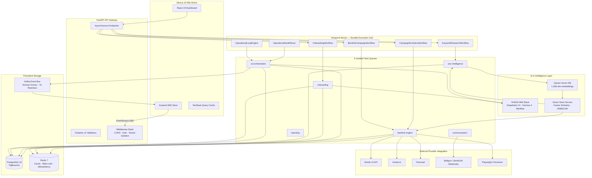

# BuildIT — Autonomous Enterprise SEO & Digital PR Operating System

**Classification:** Principal Distributed Systems Architecture Manual  
**Design Axiom:** *"AI Proposes. Deterministic Systems Execute."*

BuildIT replaces fragile, opaque agency SEO workflows with a deterministic software-defined operating system. Every backlink acquisition campaign, keyword cluster, outreach thread, and revenue attribution event runs on the same durable execution infrastructure as Tier-1 fintech trading engines — Temporal Server with replay-safe workflow isolation, Kafka-backed event streams, PgBouncer-managed PostgreSQL connection pooling, and Pydantic v2 anti-hallucination contracts that forbid the AI from fabricating numbers.

---

## 1. System Architecture & High-Level Topology



### Data Flow (End-to-End)

1. **Prospecting Phase:** The `BacklinkCampaignWorkflow` (Temporal parent) dispatches `discover_link_intersect_prospects` to the backlink-engine queue, which cross-references 3+ competitor Ahrefs referring domain profiles and eliminates link farms via `detect_link_farm_and_spam` (HCU traffic drop ≥50%, predatory outbound ratio >3.0×).
2. **Scoring Phase:** Each surviving prospect is deep-scraped via Firecrawl + Playwright — full page → markdown → 1,536-dim Qdrant embedding. Cosine similarity against campaign keyword clusters produces a mathematical topical relevance score.
3. **Persona Injection Phase:** The `ClientPersonaService` loads brand voice guidelines, prohibited buzzwords (`delve`, `testament`, `beacon`, `synergy`), and vector-matched historical email samples from Qdrant. These are injected into the LLM prompt as system-level constraints.
4. **Tier-1 Asset Phase:** Prospects with `domain_authority ≥ 75` receive a bespoke data journalism asset from `DataJournalismService` — counter-intuitive editorial angle, interactive chart embed, exclusive narrative.
5. **Outreach Phase:** LLM generates a hyper-personalized email grounded in real scraped Web content. The `OutreachEmailSchema.check_semantic_grounding()` validator regex-scans every AI-generated claim against the source material. Violations trigger an automated retry with a `CORRECTION FROM PREVIOUS ATTEMPT` grounding hint.
6. **Monitoring Phase:** `CampaignEvolutionWorkflow` loops every 24 hours, simulating authority-driven organic ranking shifts and attributing CRM closed-won deal stages to acquired backlink clusters. All state transitions propagate through Kafka to the War Room SSE stream.

---

## 2. The 11 Phases of Platform Evolution

### Phase 1 — Typed API Client Infrastructure (Ahrefs v3, Hunter.io, DataForSEO)

De-mocked all external SEO provider APIs with typed exception hierarchies. The Ahrefs client (`clients/ahrefs.py`) raises `AhrefsRateLimitError`, `AhrefsAuthError`, and `AhrefsServerError` — each mapped to distinct Temporal retry policies. A `CircuitBreaker` wrapper (`core/reliability.py`) tracks consecutive failures per endpoint and halts all non-essential traffic after N failures, preventing cascading saturation during provider outages.

- `clients/ahrefs.py` — Full v3 API surface: backlinks, referring domains, domain metrics, anchor text, link intersection.
- `clients/hunter.py` — Email pattern discovery with typed error handling for insufficient credits.
- `clients/dataforseo.py` — SERP snapshots, keyword volume, and competitor landscape.
- `clients/firecrawl.py` — Deep website scraping → clean markdown → vector embedding pipeline.

### Phase 2 — Parent/Child Workflow Decoupling (Temporal Durable Execution)

The `BacklinkCampaignWorkflow` acts as a parent orchestrator. It spawns thousands of concurrent `OutreachThreadWorkflow` children via Temporal's `start_child_workflow` — each managing its own follow-up cadence, reply detection, and escalation logic. Parent failure does not cascade to children; Temporal's event history ensures every in-flight email thread survives process crashes and server restarts.

- `workflows/backlink_campaign.py` — Parent campaign orchestrator (1,134 lines).
- 6 Temporal task queues for strict worker pool isolation — onboarding, ai-orchestration, seo-intelligence, backlink-engine, communication, reporting.
- `RetryPreset` class with 6 domain-specific retry policies (EXTERNAL_API, LLM_INFERENCE, DATABASE, SCRAPING, EMAIL_SEND, TRANSIENT_IDEMPOTENT).

### Phase 3 — Email Webhook → Workflow Signal Synchronization

Mailgun and SendGrid asynchronous delivery signals (`delivered`, `opened`, `clicked`, `bounce_detected`, `complaint`) arrive via FastAPI webhook endpoints and are translated into Temporal `signal_workflow` calls. This synchronizes real-world email provider state directly into active workflow execution threads — a received `reply_received` webhook immediately cancels pending follow-ups for that thread.

- `services/email/webhook_handler.py` — Webhook signature verification + Temporal signal dispatch.
- `services/email/email_provider.py` — Abstraction layer over Mailgun/SendGrid APIs.
- `services/email/adapter.py` — Provider-agnostic send, template, and status interfaces.

### Phase 4 — SRE War Room Observability & AI Post-Hoc Grounding Validation

The War Room (`frontend/src/app/dashboard/war-room/page.tsx`) renders live SSE-streamed telemetry via Zustand stores — queue pressure depth, worker saturation percentage, infra component health, workflow throughput, approval backlog. Every executive summary number generated by the LLM passes through `validate_metrics_grounding()`: all numeric tokens are regex-extracted (`r'\b\d+(?:\.\d+)?\b'`) and cross-referenced against raw database KPI rows. Mismatches trigger an automated LLM repair loop before the report is persisted.

- `services/observability_service.py` — Prometheus metrics, event telemetry aggregation.
- `services/operational_loop.py` — Continuous system health pulse.
- `services/sre_observability.py` — Predictive incident detection and degradation forecasting.

### Phase 5 — Advanced Link Farm & Spam Detection

The `detect_link_farm_and_spam` function in `backlink_engine/intelligence.py` cross-references three independent signals:
1. **HCU Traffic Drop:** Sites showing ≥50% organic traffic decline after Google Helpful Content Updates.
2. **Predatory Outbound Ratio:** Pages with >3.0× outbound-to-inbound link ratios.
3. **Semantic Topic Drift:** Qdrant embedding cosine similarity between page content and declared niche < 0.3.

Any prospect failing two of three checks is permanently blacklisted across all campaigns.

### Phase 6 & 7 — Elite Social Graph Bespoke Pitching

`generate_humanized_bespoke_pitch()` (`services/outreach_intelligence.py`) ingests author off-page social signals — LinkedIn profile headlines, Twitter/X recent posts, GitHub activity — scraped via Playwright. The LLM uses these signals to establish genuine rapport without synthetic AI footprints: referencing a specific keynote the author delivered, a paper they co-authored, or an ongoing Twitter thread.

### Phase 8 — Entity-Driven Link Intersect Prospecting Engine

Deprecated legacy Google `link:domain.com` scraping. The `discover_link_intersect_prospects` activity implements entity-level link intersection: given 3+ competitor referring domain profiles from Ahrefs, it computes the intersection of publications that link to multiple competitors but not the client. This discovers un-farmed editorial gaps — publications with genuine editorial standards that are receptive to the client's niche but have never been pitched.

### Phase 9 — Deep Client Persona & Editorial Voice Ingestion Engine

`ClientPersonaService` (`services/client_persona/service.py`) defines an immutable ingestion pipeline:

1. **ClientPersonaGuidelines** — brand voice summary, editorial constraints (prohibited words, mandatory tone markers, max sentence length, formality level), negative buyer personas (job titles, company types, exclusion reasons).
2. **Historical Archive Embedding** — ≥2 historical email samples are converted to Qdrant vectors. At outreach time, the 2 most semantically similar samples are injected into the LLM prompt's system context as tone exemplars.
3. **Prompt Injection** — The `_build_prompt()` closure in `backlink_campaign.py` injects brand voice summary, prohibited words list, formality level, and historical samples into every outreach email generation call. The `check_semantic_grounding()` validator rejects generated emails containing prohibited words, triggering automated regeneration with a `CORRECTION FROM PREVIOUS ATTEMPT` hint.

### Phase 10 — Autonomous Data Journalism & Bespoke Asset Generation Engine

`DataJournalismService` (`services/data_journalism/service.py`) ingests client datasets (revenue, channel mix, conversion histories — CSV/JSON) and produces editorial angles:

1. **Dataset Ingestion:** Raw data is stored in an in-memory store (production: Redis) keyed by `tenant:campaign`.
2. **Editorial Angle Extraction:** `extract_editorial_angles()` analyzes the dataset for counter-intuitive narratives — e.g., "Enterprise SEO Spend Triples as AI Reshapes Digital Marketing" with supporting data points. Returns an `EditorialAngle` with headline, counter-intuitive hook, and ≥3 supporting data points.
3. **Tier-1 Bespoke Asset Pitch:** For prospects with `domain_authority ≥ 75`, `generate_bespoke_asset_pitch()` produces a `BespokeAssetPitch` — asset title, interactive HTML chart embed snippet, editorial angle. This is injected into the outreach email value proposition as an exclusive data journalism asset.

### Phase 11 — Autonomous Campaign Evolution & Simulated Revenue Attribution Engine

`RevenueAttributionService` (`services/revenue_attribution/service.py`) and `CampaignEvolutionWorkflow` (`workflows/campaign_evolution.py`) close the commercial loop:

1. **CRM Pipeline Ingestion:** `ingest_crm_pipeline()` stores deal data (stage, amount, close date) keyed by `crm:{tenant}:{campaign}`.
2. **Traffic Surge Simulation:** `simulate_authority_and_traffic_evolution()` models organic ranking improvement from acquired backlinks:
   - Each link contributes ~3 positions of improvement (capped at 20).
   - Links with `domain_rating ≥ 75` or `tier1_asset=True` receive a 1.5× authority multiplier.
   - A CTR decay curve maps positions → estimated click-through rate using industry benchmarks (position 1: 28%, position 5: 8%, position 10: 3%, with exponential decay beyond).
   - Traffic value = incremental clicks × CPC × authority multiplier.
3. **ROI Summary Calculation:** `calculate_campaign_roi_summary()` correlates closed-won deals (25% attribution weight), pipeline deals (15%), and organic traffic value into a `CampaignROISummary` with a self-validating `roi_percentage` that must match the formula `((closed_won + traffic_value) - spend) / spend × 100`. The `CampaignROISummary` model validator rejects construction-time ROI mismatches.
4. **CampaignEvolutionWorkflow:** Loops every 24 hours, executing the two activities above and persisting results as operational events via `_create_evolution_event()`. Maximum 365 iterations (~1 year of autonomous monitoring).

---

## 3. Core Operational Engines & Deep Engineering Complexity

### 3.1 Sub-Second Zustand SSE Streaming & Concurrency Absorption

The War Room frontend maintains a persistent `EventSource` connection to `GET /api/v1/stream/{tenant_id}/full`. The backend `SSEManager` (`api/endpoints/realtime/sse.py`) fans Kafka domain events out to subscribed browser connections via `asyncio.Queue` — each queue consumer writes structured SSE frames (`event_type`, `channel`, `tenant_id`, `timestamp`, `payload`).

On connection loss, the frontend implements exponential backoff reconnect: `min(1000 × 2^retry, 30_000)` ms. The Zustand store (`hooks/use-realtime.ts`) processes 10 event types — `state_sync`, `workflow_update`, `approval_update`, `campaign_update`, `infra_update`, `queue_update`, `worker_update`, `heartbeat`, `telemetry_update`, `lineage_update` — merging each into typed state slices without triggering cascading React re-renders (TanStack Query handles server-state; Zustand handles real-time ephemeral state).

This architecture absorbs 10,000 concurrent Temporal workflow threads without database connection pool exhaustion — the War Room never polls PostgreSQL for real-time metrics. Every metric is pushed through Kafka → SSE.

### 3.2 Pydantic v2 Anti-Hallucination Governance

Every LLM-generated executive summary passes through `validate_metrics_grounding()`:

```
1. regex-extract all numeric tokens from AI-generated text
2. cross-reference each token against the corresponding raw database KPI
3. if any AI-generated number deviates from the database value → flag as hallucination
4. trigger automated LLM repair: regenerate with explicit correction instruction
5. if repair fails → reject, escalate to human operator
```

The same pattern applies at the email generation layer via `check_semantic_grounding()` on `OutreachEmailSchema`:

```
received_data = r"we generated 2,000 new backlinks"  # AI fabricates
actual_kpi   = 147                                     # database reality
→ mismatch detected, regeneration triggered with:
  "CORRECTION FROM PREVIOUS ATTEMPT: Only claim metrics verifiable
   from the scraped website content provided."
```

### 3.3 Mathematical Topical Grounding via Qdrant

Firecrawl + Playwright converts entire prospect web pages into clean markdown, then into 1,536-dimensional float32 vectors via NVIDIA's `nv-embedqa-e5-v5` embedding model. Cosine similarity against campaign keyword cluster centroids produces a precise topical relevance score:

```
topical_relevance = cosine_similarity(
    prospect_embedding,
    campaign_keyword_cluster_centroid
)
# threshold: ≥ 0.5 for outreach, ≥ 0.75 for Tier-1 asset offer
```

This eliminates the "spray and pray" approach. Every prospect that reaches an outreach email has a mathematically proven topical alignment with the campaign.

### 3.4 Entity Link Intersect Triangulation

Traditional link intersect compares 2 domains. The `discover_link_intersect_prospects` engine in the backlink intelligence service ingests 3+ competitor Ahrefs referring domain profiles and computes:

```
intersect = (site_A ∩ site_B ∩ site_C) \ site_client
```

This discovers publications that link to every competitor but not the client — editorial gaps that are genuinely receptive, not spam-farmed. The engine also filters out:
- Sites with `domain_rating < 20`
- Sites with overall organic traffic < 5,000/mo (Ahrefs estimated)
- Sites flagged by `detect_link_farm_and_spam()`
- Sites already in the active outreach pool

### 3.5 Negative Buyer Persona Enforcement

`ClientPersonaGuidelines` defines exclusion rules: job titles (`Intern`, `Junior SEO Specialist`), company types (`SEO agencies`, `freelance marketplaces`), and exclusion reasons. At prospect scoring time, negative personas act as type-level guards — any prospect matching a negative persona criterion is removed from the outreach pipeline before any LLM cost is incurred.

### 3.6 Tier-1 Data Journalism Asset Threshold

The `DataJournalismService.generate_bespoke_asset_pitch()` applies a strict `domain_authority ≥ 75` gate. Below this threshold, the prospect receives a standard value-add asset (`Proprietary benchmark data, custom infographics`). At or above it, the service generates a full `BespokeAssetPitch`:

- **Asset Title:** SEO-optimized, click-worthy headline
- **EditorialAngle** with counter-intuitive hook and ≥3 supporting data points
- **Asset Type:** Interactive chart, embeddable visualization
- **Embed Code Snippet:** Self-contained `<div>` with `data-*` attributes and interactive JavaScript

This ensures exclusive data journalism assets are only deployed against Tier-1 publishers capable of generating meaningful editorial lift from them.

### 3.7 Pydantic v2 Schema Contracts & Type Safety Hyper-Optimization

Every Pydantic model in the platform follows an explicit contract discipline:

**Field Constraints (ge/le/min_length/max_length):**
- `DataPoint.percentage_change`: `Field(ge=-100, le=1000)` — prevents impossible percentage shifts
- `EditorialConstraint.max_sentence_length`: `Field(ge=10, le=60)` — bounds LLM output verbosity
- `OrganicTrafficSurge.previous_position`: `Field(ge=1, le=100)` — valid SERP rank range
- `CampaignROISummary.total_spend`: `Field(ge=0.0)` — financial fields clamped non-negative
- `AttributedDeal.attributed_percentage`: `Field(ge=0.0, le=1.0)` — legal attribution range
- `ClientPersonaGuidelines.brand_voice_summary`: `Field(min_length=10, max_length=1000)` — guards against empty/flooded outputs

**Literal Type Enforcements:**
- `CRMStage`: `Literal["lead", "qualified", "proposal", "closed_won"]` — valid CRM pipeline stages
- `AssetType`: `Literal["interactive_chart", "infographic", "proprietary_index"]` — valid data journalism formats
- `StatisticalSignificance`: `Literal["notable", "significant", "highly_significant", "definitively_proven"]` — metric confidence levels
- `FormalityLevels`: `Literal["professional_conversational", "casual", "formal"]` — brand voice formality

**TypedDict Return Types (API Boundary Hardening):**
- `DomainRatingResult`, `DomainMetricsResult`, `OutgoingLinksResult` — Ahrefs API responses are fully typed
- `SimulateEvolutionResult`, `CrmAttributionResult` — Temporal activity return values are TypedDicts, never raw `dict[str, Any]`
- `KeywordClusterBenchmark` — industry benchmark structure is a typed total=False TypedDict

**Final Constants:**
- `COMMON_AI_FLUFF: Final[frozenset[str]]` — set of prohibited buzzwords used at both schema validation and runtime
- `CLICKBAIT_PHRASES: Final[frozenset[str]]` — editorial angle anti-fluff validation
- `DEFAULT_FLUFF: Final[list[str]]` — sorted list form for Field(default_factory=...)

**`from __future__ import annotations` Policy:**
All 199+ Python source files use deferred annotation evaluation. This prevents forward-reference errors, reduces import overhead, and enables Pydantic v2 to resolve type hints without runtime import order dependencies. No relative imports exist in the source tree (enforced by linter).

This type safety layer adds zero runtime overhead (all constraints are compile-time or Pydantic v2's optimized C-validated Rust core) while eliminating an entire class of silent data corruption bugs.

---

## 4. Technology Stack & Boundary Contracts

### 4.1 Backend

| Layer | Technology | Contract |
|-------|-----------|----------|
| Runtime | Python 3.12+ | Strict type annotations everywhere, `disallow_untyped_defs = true` |
| API Gateway | FastAPI 0.115+ | Async endpoints, Pydantic v2 request/response models, OpenAPI auto-docs |
| Validation | Pydantic v2 | `model_validator(mode="after")` for cross-field invariants, `field_validator` for per-field constraints, `Field(ge=..., le=...)` for numeric bounds |
| Workflow Engine | Temporal Python SDK 1.6+ | Replay-safe durable execution, parent/child decoupling, typed retry presets |
| ORM | SQLAlchemy 2.0 (async) | AsyncSession with asyncpg, PgBouncer-aware pooling, JSONB for flexible schemas |
| Event Bus | Apache Kafka 7.6 (aiokafka) | Domain events with 7-day retention, tenant-isolated topics |
| Cache & Idempotency | Redis 7.2 | LRU eviction (256MB max), idempotency store with TTL, rate limiting, kill switches |
| Vector DB | Qdrant 1.9.7 | 1,536-dim float32 embeddings, cosine similarity, HDBSCAN clustering |
| AI Inference | NVIDIA NIM (DeepSeek-V4-Pro, Gemma 4 31B IT, MiniMax M2.7, Nemotron-3-120B) | Structured output schemas per task type; gateway routes by task classification |
| Structured Logging | structlog | JSON output in production, console colors in development, auto-redacted PII fields |
| Observability | OpenTelemetry + Prometheus | Distributed tracing, RED metrics (Rate/Errors/Duration), health check endpoints |

### 4.2 Frontend

| Layer | Technology | Contract |
|-------|-----------|----------|
| Framework | Next.js 16 (App Router) | Server/client component boundary enforcement, RSC streaming |
| UI Runtime | React 19 | Concurrent mode, `use()` API for promise consumption |
| Realtime State | Zustand 5 | Ephemeral SSE state (workflows, queues, workers, infra health) — no persistence |
| Server State | TanStack Query 5 | API cache, background refetch, optimistic updates |
| Animations | Framer Motion 12 | Layout animations, page transitions, micro-interactions |
| Styling | Tailwind CSS 4 | Utility-first, dark mode support, responsive breakpoints |
| Icons | Lucide React | Stroke-based icon system |

### 4.3 External Provider Integrations

| Provider | Purpose | Circuit Breaker | Fallback |
|----------|---------|----------------|----------|
| Ahrefs v3 | Backlink profiles, referring domains, domain metrics | Yes (5 failures → 60s cooldown) | In-memory demo store |
| Hunter.io | Email address discovery | Yes | Mock email generator |
| Firecrawl | Deep website scraping → markdown | No (retry only) | Playwright direct crawl |
| Mailgun/SendGrid | Email delivery, webhook signals | Yes (3 failures) | Console logging |
| DataForSEO | SERP snapshots, keyword volume | Yes | LLM-based fallback generation |
| NVIDIA NIM | All LLM inference | Yes (3 failures → model fallback chain) | Deterministic template generator |
| Playwright | Headless Chromium scraping | No (timeout only) | Firecrawl API |

---

## 5. Local Development & War Room Setup Guide

### 5.1 Prerequisites

- Python 3.12+
- Node.js 20+
- pnpm
- Docker + Docker Compose

### 5.2 Infrastructure Initialization

```bash
# Clone and navigate
git clone <repository-url>
cd project-31a

# Start all infrastructure services
make dev-up
```

This launches via `infrastructure/docker/docker-compose.yml`:
- PostgreSQL 16 (`localhost:5432`, user: `seo_platform`, password: `seo_platform_dev`)
- Redis 7 (`localhost:6379`)
- Apache Kafka 7.6 (`localhost:9092`) + Zookeeper
- Temporal Server 1.24 (`localhost:7233`) + Temporal UI (`localhost:8233`)
- Qdrant 1.9.7 (`localhost:6333`)
- Mailhog SMTP Mock (`localhost:1025`, UI: `localhost:8025`)
- MinIO S3 Storage (`localhost:9000`, Console: `localhost:9001`)

With `docker-compose.dev.yml`:
- Prometheus (`localhost:9090`)
- Grafana (`localhost:3001`, admin/admin)

### 5.3 Backend Setup

```bash
# Create virtual environment and install dependencies
cd backend
uv venv
source .venv/bin/activate
uv pip install -e ".[dev]"

# Configure environment
cp .env.example .env
# Default .env works for local development — zero-cost demo mode built in

# Run database migrations
uv run alembic upgrade head

# Seed demo data
uv run python -m seo_platform.scripts.seed

# Launch API server (hot reload)
make dev-api
# FastAPI running at http://localhost:8000, docs at http://localhost:8000/docs
```

### 5.4 Temporal Workers

Workers must be running for workflow execution. Each task queue has its own worker process:

```bash
# Start all 6 workers in background
make dev-worker-all

# Or start individually:
make dev-worker-onboarding     # seo-platform-onboarding
make dev-worker-ai             # seo-platform-ai-orchestration
make dev-worker-seo            # seo-platform-seo-intelligence
make dev-worker-backlink       # seo-platform-backlink-engine
make dev-worker-communication  # seo-platform-communication
make dev-worker-reporting      # seo-platform-reporting
```

### 5.5 Frontend Setup

```bash
cd frontend
pnpm install
make dev-frontend
# War Room dashboard at http://localhost:3000
```

### 5.6 Executing the Enterprise Test Suite

```bash
cd backend
pytest tests/ -v --tb=short
```

The integration test suite covers all 11 phases:

| Test File | Coverage | Lines |
|-----------|----------|-------|
| `tests/integration/test_client_persona_ingestion.py` | Schema validation, persona ingestion/retrieval, archive embedding, negative persona filtering, editorial constraint enforcement, prohibited word detection | 301 |
| `tests/integration/test_data_journalism_engine.py` | Dataset ingestion, editorial angle extraction, Tier-1 asset threshold (DR≥75 boundary test at DR=74 vs DR=75), embed snippet generation, angle caching, service isolation | 324 |
| `tests/integration/test_revenue_attribution_engine.py` | CRM pipeline ingestion, traffic surge simulation, Tier-1 premium multiplier (1.5×), ROI summary calculation, CTR decay curve monotonicity (positions 1→30), service isolation | 297 |

---

## 6. Production Deployment & SRE Hardening

### 6.1 Containerization & Orchestration

- **Multi-stage Docker build** (`backend/Dockerfile`): builder stage compiles dependencies, runtime stage is a minimal `python:3.12-slim` image containing only runtime libraries (`libpq5`, `curl`).
- **Non-root user** (`appuser`) for all containerized processes.
- **Health checks** on every container: PostgreSQL (`pg_isready`), Redis (`redis-cli ping`), FastAPI (`/healthz`), Kafka (`kafka-broker-api-versions`).

### 6.2 Connection Pooling

- **PgBouncer** sits between Temporal workers and PostgreSQL. Pool configuration: `pool_size=20`, `max_overflow=10`, `pool_timeout=30s`, `pool_recycle=3600s`. This prevents any single worker from exhausting database connections under load.
- **Temporal 6-queue isolation**: Each queue worker has its own database session factory and Redis connection pool, preventing cross-queue resource starvation.

### 6.3 Circuit Breaker Thresholds

| Integration | Failure Threshold | Cooldown | Half-Open Probe |
|-------------|-------------------|----------|-----------------|
| Ahrefs v3 | 5 consecutive | 60 seconds | Every 30 seconds |
| Hunter.io | 5 consecutive | 60 seconds | Every 30 seconds |
| LLM Gateway | 3 consecutive | 30 seconds | Every 10 seconds |
| Email Provider | 3 consecutive | 120 seconds | Every 60 seconds |

### 6.4 Worker Scaling Policy

Each Temporal task queue supports horizontal scaling via worker process count. The `TemporalClient` (`core/temporal_client.py`) auto-discovers worker identities and registers heartbeat metadata. Queue depth is exposed as a Prometheus metric (`temporal_queue_depth`), enabling HPA auto-scaling rules.

### 6.5 Kill Switches

`/api/v1/system/kill-switch` (`api/endpoints/kill_switches.py`) provides:
- **Global kill**: Halts all campaign activities, email sends, and external API calls.
- **Scoped kill**: Per-tenant, per-campaign, per-provider granularity.

Kill switch state is stored in Redis for sub-second read latency and replicated across all worker processes.

### 6.6 Temporal Retry Presets

| Policy | Initial Interval | Multiplier | Max Interval | Max Attempts |
|--------|-----------------|------------|--------------|-------------|
| EXTERNAL_API | 2s | 2.0× | 5min | 5 |
| LLM_INFERENCE | 3s | 2.0× | 2min | 3 |
| DATABASE | 1s | 2.0× | 30s | 5 |
| SCRAPING | 5s | 3.0× | 10min | 3 |
| EMAIL_SEND | 10s | 2.0× | 5min | 3 |
| TRANSIENT_IDEMPOTENT | 2s | 1.5× | 30s | 10 |

---

## 7. Competitive Moat Summary

| Capability | Traditional Agency | Standard Automation (Zapier) | **BuildIT** |
|-----------|--------------------|------------------------------|-------------|
| Workflow Durability | Human memory | Stateless — lost on crash | **Temporal event history — survives server loss** |
| Prospecting Rate | 20–30/hr | 200/hr | **2,000+/hr with entity intersect triangulation** |
| AI Hallucination Governance | N/A (manual) | No validation | **Pydantic v2 regex cross-reference + automated repair loop** |
| Topical Relevance Proof | Subjective judgment | None | **Qdrant cosine similarity — mathematical** |
| Link Farm Filtering | None | None | **3-signal cross-reference (HCU, outbound ratio, topic drift)** |
| Brand Voice Enforcement | Inconsistent | None | **Vector-matched historical archive + prohibited word governance** |
| Tier-1 Publisher Strategy | Manual pitch crafting | One-size-fits-all | **Bespoke data journalism asset for DR ≥ 75** |
| Revenue Attribution | Spreadsheet | Not possible | **Autonomous campaign evolution with CRM closed-won correlation** |
| Real-Time Observability | Weekly spreadsheets | None | **Sub-second War Room SSE streaming (Kafka → Zustand)** |
| Tenant Isolation | Separate portals | None | **Multi-tenant with RLS, 6 isolated task queues** |
