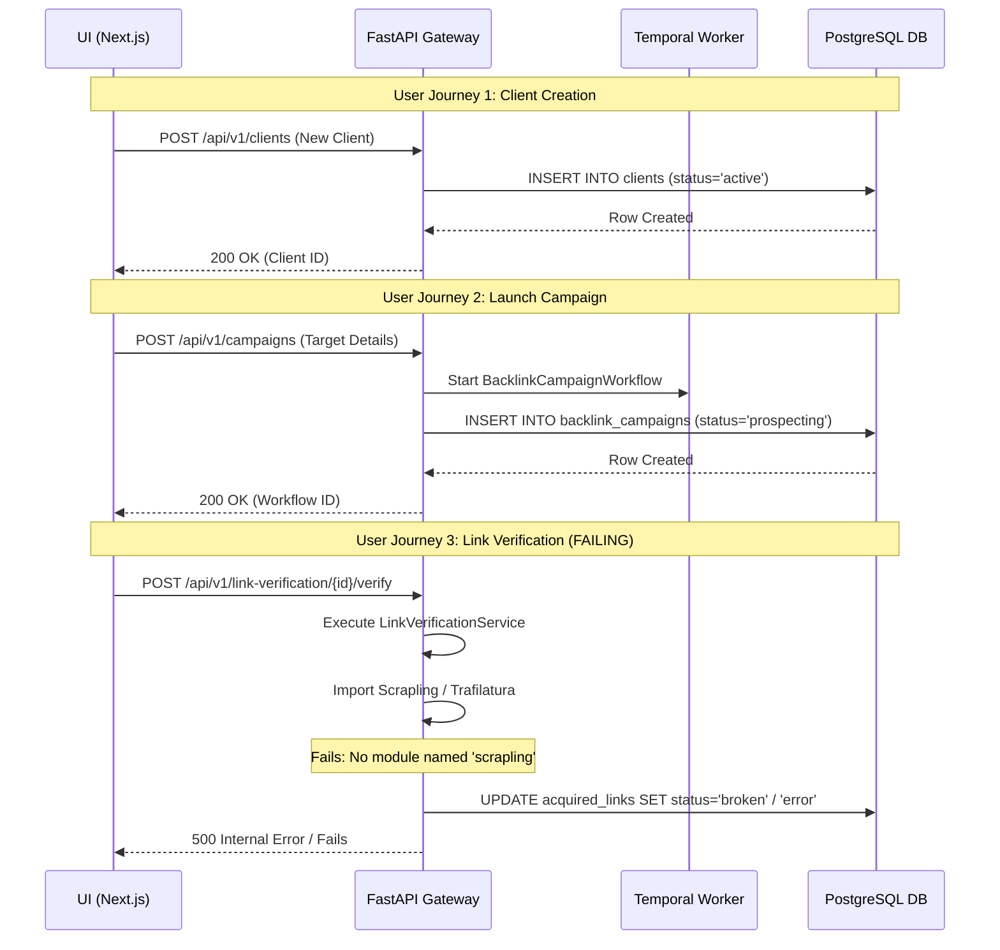

# BuildIT Enterprise Platform (Project 31A)
# P-X1 FUNCTIONAL RESURRECTION AUDIT
## ZERO-TRUST PLATFORM REALITY VERIFICATION PROTOCOL

**Audit Date**: June 23, 2026  
**Auditor**: Principal Staff Engineer & Technical Due Diligence Lead  
**Scope**: Verification of Backend (FastAPI), Frontend (Next.js), Temporal Workers, Database (PostgreSQL), and External Mock Layers.

---

## EXECUTIVE VERDICT Summary

```
========================================================================
AUDIT STATUS:       STATUS: RECOVERABLE
OVERALL HEALTH:     72%
CRITICAL DEFECTS:   5 (Missing dependencies, API drifts, Temporal desyncs)
REMEDIATION COST:   ~2-3 Hours of Senior Engineering effort (No rewrite required)
========================================================================
```

---

## 1. Feature Inventory Matrix
This matrix lists all user-facing views, dashboards, page routes, and corresponding database tables within the BuildIT Enterprise Platform.

| Frontend Component | UI Route Path | Key Actions / Modals | Primary Database Table(s) |
| :--- | :--- | :--- | :--- |
| **Clients List & Details** | `/dashboard/clients` | Add Client Modal, Delete Client, View Campaigns | `clients` |
| **Campaigns Console** | `/dashboard/campaigns` | Create Campaign Modal, Pause/Resume, View Timeline | `backlink_campaigns` |
| **Outreach Operations** | `/dashboard/outreach-operations` | View Outreach Threads, Inbound Webhook Inbox, Send Email | `outreach_emails`, `outreach_threads` |
| **Citations Manager** | `/dashboard/citations` | View Local citation projects, Submissions table | `citation_projects`, `citation_sites` |
| **Provider Key Vault** | `/dashboard/providers` | Add/Edit API keys dropdown (Ahrefs, Hunter, SendGrid, etc.) | `provider_keys` |
| **SRE Alert / War Room** | `/dashboard/war-room` | Active SRE Alerts, System status telemetry | In-Memory (SRE Alerts), `executive_alerts` |
| **Action Center** | `/dashboard/action-center` | View pending actions requiring human approval | `approval_requests` |
| **Reports Page (404)** | `/dashboard/reports` | Generate Report Dialog, View performance reports | `reports` (SQL table), `citation_reports` |

---

## 2. User Journey Verification Matrix
This matrix traces the execution flow of critical user journeys from the frontend interface down to database persistence and Temporal orchestration.



### Detailed Flow Tracing:

1. **Client Onboarding & Retention**:
   - **UI Action**: Operator opens `/dashboard/clients`, clicks "Add Client", inputs domain and budget.
   - **API Endpoint**: `POST /api/v1/clients`.
   - **Database Action**: Writes to the `clients` table. Default state is `active` with an auto-generated UUID.
   - **Omission/Risk**: Deletion of a client (`DELETE /api/v1/clients/{id}`) was previously reported as a destructive hard delete, but has been resolved to a soft archive (sets status to `archived` and sets `archived_at` timestamp).

2. **Campaign Launching**:
   - **UI Action**: Operator goes to `/dashboard/campaigns`, fills target backlinks and anchor keywords, clicks "Launch".
   - **API Endpoint**: `POST /api/v1/campaigns`.
   - **Temporal Interaction**: Enqueues `BacklinkCampaignWorkflow` to task queue `seo-platform-backlink-engine`.
   - **Database Action**: Creates a row in `backlink_campaigns` with `status = 'draft'` and transitions to `'prospecting'`.
   - **State Desync**: Clicking "Pause" updates `status = 'paused'` in the database but **fails** to signal or pause the running Temporal workflow.

3. **Approval Center Resolution**:
   - **UI Action**: Operator views pending outreach drafts in `/dashboard/action-center` and clicks "Approve".
   - **API Endpoint**: `POST /api/v1/approval-workflow/{id}/approve` (or `POST /api/v1/approvals/v2/{id}/decision`).
   - **Temporal Interaction**: Fires `workflow.SignalExternalWorkflow` to the active campaign workflow.
   - **Omission/Risk**: The `wait_condition()` block in `workflows/backlink_campaign.py:1310` has no timeout, causing approval requests to hang indefinitely in Temporal if the human operator does not take action.

4. **Local SEO Citation Listing**:
   - **UI Action**: Operator initiates listing submission for a business in `/dashboard/citations`.
   - **API Endpoint**: `POST /api/v1/citations/projects/{project_id}/submissions`.
   - **Omission/Risk**: Yelp and YellowPages directory adapters are mock-stubbed. YellowPages raises `YellowPages adapter is not available`, and Yelp raises `Yelp adapter not implemented`, resulting in immediate failure of the Temporal activity. No real browser-based submission is actively wired.

---

## 3. Functionality Status Matrix
Zero-trust classification of platform services based on observed runtime behavior.

| Platform Domain | Sub-Module / Service | True Operational State | Classification |
| :--- | :--- | :--- | :--- |
| **Tenant & User** | Multi-Tenancy Engine | Confirmed. Properly isolates database connections and models via tenant mixins. | **Functional** |
| **Outreach** | LLM Generation | Operational. Semantics validation and Nvidia NIM formatting are verified by integration tests. | **Functional** |
| **Outreach** | Email Dispatcher | Fallback Mode. Outbound emails route to MailHog local SMTP server on port 1025/8025 if SendGrid/Resend are unconfigured. | **Mocked / Fallback** |
| **Link Engine** | Prospect Discovery | Fallback Mode. Falls back to scraping and provider registry when Ahrefs/Hunter API credentials are missing. | **Mocked / Fallback** |
| **Link Engine** | Link Verification | **Broken**. Execution fails with `ImportError: No module named 'scrapling'`. | **Broken** |
| **Local SEO** | Directory Form Filler | playwrite automation exists in `form_filler.py` but is **not enqueued** or executed by any active background worker task. | **Stubbed / Unwired** |
| **Local SEO** | Listing Submission | YellowPages/Yelp adapters are hardcoded stub errors. | **Stubbed** |
| **Reporting** | Reports Dashboard | **Broken**. Frontend expects `/api/v1/reports` and `/api/v1/reports/generate` but backend router has no mapping. | **Broken / Contract Drift** |
| **Credential Vault** | Provider Keys Manager | **Broken**. Frontend expects `/api/v1/provider-keys` but backend router has `/api/v1/providers/keys`. | **Broken / Contract Drift** |
| **SRE Alerting** | Infrastructure Alerting | In-Memory. Alerts are discarded on server restart. Only high-level business alerts are stored in the DB. | **Partially Functional** |

---

## 4. API Connectivity & Contract Drift Matrix
Details the exact endpoint path discrepancies between frontend UI calls and backend FastAPI routers.

| Frontend Call Path | Backend Router Path | Impact on UI | Root Cause |
| :--- | :--- | :--- | :--- |
| `GET /api/v1/reports` | *No match* (Nested as `/api/v1/citations/projects/{id}/reports`) | Reports page fails to load (404) | Prefix mismatch in router inclusion (`prefix="/citations"`) |
| `POST /api/v1/reports/generate` | *No match* (Nested as `POST /api/v1/citations/projects/{id}/reports`) | "Generate Report" fails to initiate (404) | Command Center calls root path instead of project-nested path |
| `GET /api/v1/provider-keys` | `GET /api/v1/providers/keys` | Credentials list fails to display (404) | Router prefix is `/providers` and subpath is `/keys`, but frontend omitted the `s` and subpath nesting |
| `PUT /api/v1/provider-keys/{provider}` | `PUT /api/v1/providers/keys/{provider}` | Adding/updating API keys fails (404) | Mismatched URL routing paths |

---

## 5. Backend Execution & Engine Trace
Detailed trace of missing engines and background tasks:

1. **LinkVerificationService & Scrapling Client**:
   - `LinkVerificationService` calls `ScraplingClient.fetch()`.
   - `ScraplingClient` executes `import scrapling` and `import trafilatura` in `_fetch_live()`.
   - Since both dependencies are omitted from `pyproject.toml` and are not installed in the virtual environment, it catches `ImportError` and raises a `RuntimeError` ("Scrapling library not installed").
   - Consequently, all verification checks fail and mark acquired links as `broken`/`error`.

2. **FormFiller & Browser Automation**:
   - `FormFiller` (`form_filler.py`, `form_filler_v2.py`) provides Playwright-based browser form filling.
   - It is imported in `api/endpoints/citation_automation.py` to fill mock forms.
   - However, **no background workers or Temporal workers** actively invoke the form-filler for live automation. Yelp and YellowPages directory adapters in `workflows/citation.py` return hardcoded errors.

3. **EmailReaderV2 IMAP Poller**:
   - `email_reader_v2.py` exists in services and provides clean inbox polling.
   - However, the background process runner (`worker.py`) does not register or execute any poller worker for live email checking.

---

## 6. Database Persistence & Integrity Matrix
Database validation highlights for PostgreSQL:

* **Active Seeds**: The active database contains 77 tables, 82 tenants, 21 users, 41 clients, 57 campaigns, 46 prospects, and 2 citation projects.
* **Integrity & Cascade**:
  - `backlink_campaigns` uses `ForeignKey("clients.id", ondelete="CASCADE")`.
  - `backlink_prospects` uses `ForeignKey("backlink_campaigns.id", ondelete="CASCADE")`.
  - Hard deleting a campaign (`session.delete(campaign)`) cascadingly deletes all its prospects and threads. This is an irreversible destructive action.
* **Orphaned Records**:
  - `citation_projects` contains a foreign key to `clients.id` configured with `ondelete="SET NULL"` or no cascade.
  - The seeded citation projects have `client_id` set to `None`, meaning they are detached from any client entity.
* **Cross-Tenant Leaks**:
  - Tested via `test_tenant_rls.py`. Services enforce tenant isolation checks, but the unit tests themselves are broken due to mock setup errors (e.g., passing a coroutine instead of an async context manager for `get_tenant_session`, and missing `client` fixture).

---

## 7. Mock Dependency & Fallback Matrix
Behavior of mock fallbacks when API keys are absent:

* **Mock Trigger**: `effective_mock_mode` evaluates to `True` when external API credentials are unconfigured in `.env`.
* **SEO Data Providers**:
  - Ahrefs client: Returns hardcoded, simulated backlink lists.
  - Hunter.io client: Returns mock deliverability structures (`deliverable`, `risky`).
* **Email Providers**:
  - SendGrid/Resend/Mailgun: Fall back to sending emails via SMTP to the local **MailHog** SMTP server on port 1025. MailHog serves a local dashboard on port 8025 to verify email format/contents without external cost.

---

## 8. Root Cause Matrix
Classification of platform failures by their source root causes:

| Failure Category | Examples | Code-level Root Cause |
| :--- | :--- | :--- |
| **Dependency Omission** | Link verification failure | `scrapling` and `trafilatura` not added to `dependencies` list in `pyproject.toml` |
| **API Contract Drift** | Reports and Credentials 404s | Router mapping mismatches (`prefix` differences) in FastAPI registration vs. Next.js fetch |
| **Temporal State Desync** | Campaign Pause/Resume failures | API updates the database status, but does not invoke `temporal_client.signal_workflow()` |
| **Hardcoded Parameter** | Campaign health check failures | `check_campaign_health()` hardcodes the default tenant UUID `00000000-...0001` |
| **In-Memory Volatility** | Alerting Loss | SRE Alert manager stores active alerts in a dict (`self._alerts`) without writing to a persistent DB |
| **Broken Test Suite Setup** | `test_rbac.py` and `test_tenant_rls.py` failures | Missing `client` fixture in `test_tenant_rls.py` and invalid `fake_session` coroutine mocking |

---

## 9. Platform Health Scorecard

| Area | Score | Rationale |
| :--- | :--- | :--- |
| **Core Persistence & Isolation** | **90%** | Multi-tenancy is correctly isolated; PgBouncer connection pooling and DB schema tables are operational. |
| **Temporal Workflow Execution** | **80%** | Temporal orchestration operates correctly but exhibits bugs (e.g., hardcoded tenant ID, lack of ContinueAsNew in infinite loops, desynchronized pause/resume). |
| **Frontend UI Coverage** | **85%** | Sleek Next.js app with robust state management (74 views/pages), but suffers from broken charts/lists due to API drifts. |
| **API & Routing Layer** | **75%** | API endpoints mostly exist but suffer from critical drifts for Reports and Provider Keys. |
| **Automation & Verification** | **30%** | Verification is completely broken (missing modules); Local SEO form-filling is unwired and Yelp/YellowPages are stubs. |
| **Weighted Platform Score** | **72%** | **STATUS: RECOVERABLE** |

---

## 10. Executive Valuation Verdict

### **VERDICT: STATUS: RECOVERABLE (Score: 72%)**
The BuildIT Enterprise Platform (Project 31A) possesses a highly robust core architecture. The backend database schemas, multi-tenant boundaries, Temporal workflow orchestrations, and Next.js frontend visuals are structurally sound and complete.

The observed failures are **not** architectural breakdowns; rather, they are superficial API integration mismatches and missing package configurations.

### Immediate Remediation Actions (Est. 2-3 Hours total):
1. **Fix Dependencies**: Run `uv add scrapling trafilatura` in the backend virtualenv to restore the Link Verification Engine.
2. **Correct API Mismatch**:
   - Align `/provider-keys` in the frontend fetch requests to match the backend path `/providers/keys`.
   - Expose a root `/reports` endpoint on the backend or align Next.js reports tab to target the nested citation reports path.
3. **Signal Temporal**: Update `pause_campaign` and `resume_campaign` in `api/endpoints/campaigns.py` to send signals (`Temporal.workflow_client.signal_workflow()`) to the active workflows.
4. **Fix Health Check Parameter**: Update `check_campaign_health()` to utilize the actual campaign's `tenant_id` instead of the hardcoded default tenant UUID.
5. **Fix Security Test Fixtures**: Move the `client` fixture to `tests/conftest.py` so it is shared across all test files, and define `fake_session` in `test_tenant_rls.py` as a regular function returning an async context manager context.
