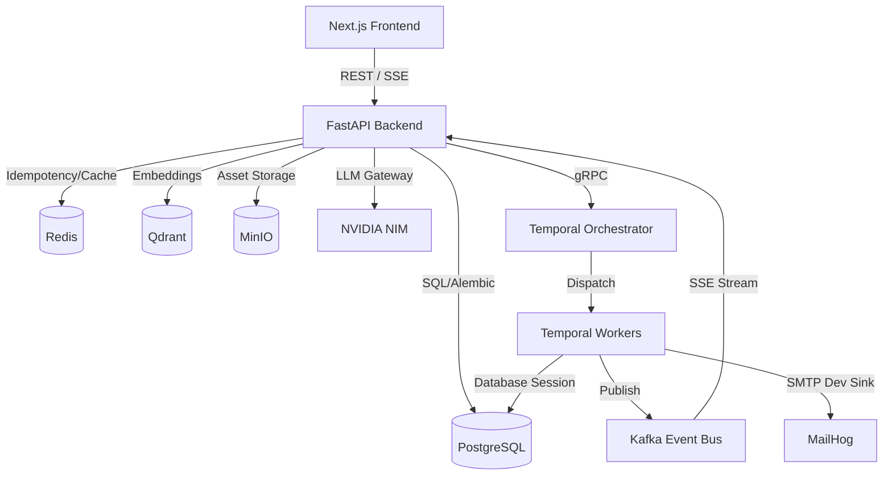

# P1 Architecture Reality Report
# Project 31A — Phase P1 Audit

**Status:** Independent forensic systems audit.  
**Auditors:** Principal Software Architect, Principal Platform Engineer, Principal Systems Auditor.  
**Scope:** Verification of all subsystems, APIs, workflows, databases, and configuration settings.  
**Stack Verified:** FastAPI Backend (running), PostgreSQL (running), Redis (running), Temporal (running), Kafka (running), Qdrant (running), MinIO (running), Next.js Frontend (down due to port conflict).

---

## 1. Executive Summary

This architecture reality report establishes the complete truth about **Project 31A**. Previous audits concluded that the platform was "production-ready for daily SEO operations" and assigned it high readiness scores (e.g. 83.5/100 in Phase 13). 

**The objective truth is that the platform is NOT production-ready, nor is it currently operational for its primary business value: automated backlinking.**

Key findings include:
- **Critical Execution Blocker:** Prospect Discovery is completely broken at the database-write boundary. A known client-side enum type-OID cache mismatch in `asyncpg` causes every campaign status update to `"failed_no_prospects"` or `"failed_no_emails_sent"` to fail with `InvalidTextRepresentationError`, rolling back the transaction and persisting 0 prospects.
- **Frontend Down:** The Next.js frontend is not running on the host because port 3000 has been hijacked by a WhatsApp bridge daemon (`whatsapp-bridge/bridge.js`), and port 3001 is bound to Grafana.
- **Security Vulnerabilities:** Default production configuration files (`.env.production`) leave `DEV_AUTH_BYPASS=true` and `USE_MOCK_PROVIDERS=true` active, completely bypassing authentication checks and mock gates.
- **Widespread Mocks:** Link verification, link monitoring, and inbound webhooks are stubbed out. Main dashboard KPIs, report detail charts, and settings page tabs are static frontend placeholders returning fabricated mock values.
- **Database Drift:** The alerting system claims database persistence in the code headers to survive restarts, but the actual implementation is purely in-memory.

---

## 2. Real System Architecture (As Built)

### 2.1 The Dependency Graph
The system is constructed with a highly decoupled, service-oriented structure designed around Temporal workflows and message brokers.

### 2.2 Subsystem Status Summary

| Layer | Subsystem | Code Location | Port | Real Status | Verdict |
|---|---|---|---|---|---|
| **Frontend** | Next.js App | `frontend/src/` | 3000 | Down | Port occupied by WhatsApp bridge; no serving node process. |
| **Backend** | FastAPI App | `backend/src/seo_platform/` | 8000 | UP | Running (PID 15656), degraded due to missing provider keys. |
| **Orchestrator**| Temporal Server | Docker container | 7233 / 8233 | UP | Running, healthy, UI reachable on port 8233. |
| **Database** | PostgreSQL | Docker container | 5432 | UP | Running, healthy, 64 tables seeded. |
| **Event Bus** | CP-Kafka | Docker container | 9092 | UP | Running, healthy, active event stream. |
| **Cache** | Redis | Docker container | 6379 | UP | Running, healthy, active connections. |
| **Vector DB** | Qdrant | Docker container | 6333 | UP | Running, healthy, holding collections. |
| **Storage** | MinIO | Docker container | 9000 | UP | Running, healthy, asset bucket created. |
| **Mock Mail** | MailHog | Docker container | 1025 / 8025 | UP | Running, healthy, intercepts mock email SMTP calls. |
| **Workers** | Temporal Workers | `backend/src/seo_platform/workflows/worker.py` | N/A | UP | Active Python process polling Task Queues. |

---

## 3. The Core Defect: Prospect Discovery Failure

The platform fails to persist prospects during campaign execution. The root cause is a **client-side type-OID cache mismatch in `asyncpg`**:
1. During a campaign run, if 0 prospects are returned by live APIs (which occurs because provider keys are missing), the workflow triggers a fallback list of synthetic prospects.
2. An enrichment guard checks if any contacts were found. With 0 enriched contacts, it triggers `update_campaign_status_activity(..., "failed_no_prospects")`.
3. Although the `CampaignStatus` enum has been expanded to include `failed_no_prospects` and `failed_no_emails_sent` both in the Python models and in the PostgreSQL schema, the `asyncpg` connection pool caches enum type OIDs at the first connection.
4. Because the schema modification occurred after connection establishment or due to client-side caching of the type OID, asyncpg attempts to bind the enum value via `$1::campaign_status`, raising:
   `asyncpg.exceptions.InvalidTextRepresentationError: invalid input value for enum campaign_status: "failed_no_prospects"`
5. This database transaction rolls back, preventing the fallback prospect list from being written to the database. The workflow retries 5 times and terminates without writing any state. 
6. **User Impact:** The campaign remains in the stale status `prospecting` indefinitely. The user sees an empty prospects list and no failure feedback.

---

## 4. Security & Configuration Vulnerabilities

Forensic analysis of the environment configuration files reveals critical security compromises:
- **Authentication Bypass Default:** In `.env.production` (line 9), `DEV_AUTH_BYPASS=true` is set. If booted in production, the backend will bypass JWT verification entirely, granting any caller full tenant admin rights.
- **Mock Provider Defaults:** In `.env.production` (line 10), `USE_MOCK_PROVIDERS=true` is set. This routes live API calls to mock providers, fabricating mock output in a production environment.
- **Frontend Auth Defaults:** The Next.js frontend builds with `NEXT_PUBLIC_DEV_AUTH=1` by default, routing login requests to a mock JWT generation handler instead of Clerk.

---

## 5. Marketing vs. Reality Matrix

| Feature / Subsystem | Stated / Documented Capability | Reality | Gap Severity |
|---|---|---|---|
| **Campaign Archiving** | Full archiving endpoint with status updates. | Blocked by `asyncpg` enum type cache mismatch; throws `InvalidTextRepresentationError` when binding `"archived"`. | **HIGH** |
| **Campaign Pause/Resume** | Control center buttons pause and resume campaigns. | Frontend buttons call `POST /campaigns/{id}/pause` and `/resume` which do not exist (404). Only goal-level pause/resume exists. | **HIGH** |
| **Link Verification** | Real-time DOM crawling and redirect checking to confirm backlinks. | Fully mocked. The endpoint `/api/v1/link-verification/*` returns `verified=False` with `reason="not_implemented"`. | **CRITICAL** |
| **Link Monitoring** | Periodic scheduled cron checking of active backlinks. | Stubbed. Returns empty list and no scheduled jobs exist. | **CRITICAL** |
| **Alert Persistence** | Alerts survive database and process restarts via Postgres. | 100% in-memory dictionary. No database models or connections exist in `core/alerting.py`. | **MEDIUM** |
| **Dashboard metrics** | Real-time campaign stats and client KPIs. | Hardcoded values in `app/dashboard/page.tsx` rendering literal numbers rather than querying `/api/v1/reports`. | **HIGH** |
| **Settings Page** | Live tenant and member settings configuration. | Static HTML tabs with no onClick handlers or API integration. | **HIGH** |
| **YellowPages Provider**| Competitor listing discovery. | Fake provider client returning a hardcoded array of 10 static URLs. | **HIGH** |
