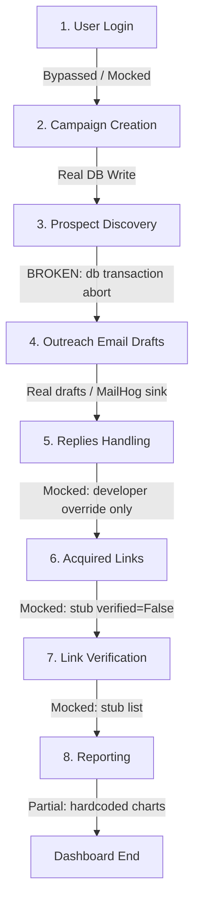

# P1 User Journey Map
# Project 31A — Phase P1 Audit

**Status:** Independent forensic systems audit.  
**Auditors:** Principal Software Architect, Principal Platform Engineer, Principal Systems Auditor.  
**Scope:** Verification of all subsystems, APIs, workflows, databases, and configuration settings.  

---

## 1. End-to-End User Journey Trace

---

## 2. Journey Step Details

### 2.1 User Login
- **Status:** **MOCKED / PARTIAL**
- **Reality:** Clerk JWT auth is implemented but inactive. In development, the backend uses `DEV_AUTH_BYPASS=true` to automatically log in the operator. The frontend login form uses a fake JWT generator when `NEXT_PUBLIC_DEV_AUTH=1`.
- **Verdict:** Mocked in development; requires configuration in production.

### 2.2 Campaign Creation
- **Status:** **REAL**
- **Reality:** Clicks on "Create Campaign" post metadata directly to `POST /api/v1/campaigns`. The campaign row is successfully written to `backlink_campaigns` in PostgreSQL.
- **Verdict:** Real database persistence works.

### 2.3 Prospect Discovery
- **Status:** **BROKEN**
- **Reality:** Clicking "Launch Campaign" triggers the Temporal workflow. However, the worker database updates crash due to the `asyncpg` type-OID cache mismatch when attempting to write status updates (`"failed_no_prospects"`). The entire database transaction rolls back, resulting in 0 prospects persisted.
- **Verdict:** Broken end-to-end; no prospects can be collected.

### 2.4 Outreach Email Drafts
- **Status:** **MOCKED / PARTIAL**
- **Reality:** The system utilizes the NVIDIA NIM meta/llama model to draft email templates from in-memory prospects. The drafts are saved to the database. However, actual outbound email delivery uses a local `MailHog` development SMTP sink rather than real email providers.
- **Verdict:** Partial (drafting is real, delivery is mocked).

### 2.5 Replies Handling
- **Status:** **MISSING / MOCKED**
- **Reality:** The inbound webhook router is stubbed out. The only way to receive a reply is to manually hit the developer endpoint `POST /api/v1/backlink-acquisition/simulate-reply` with mock data.
- **Verdict:** Missing real integration.

### 2.6 Acquired Links
- **Status:** **MOCKED**
- **Reality:** Stored in the `acquired_links` table, but rows are only populated via manual admin overrides (`POST /api/v1/backlink-acquisition/mark-link-acquired`) rather than automated workflows.
- **Verdict:** Mocked override.

### 2.7 Link Verification
- **Status:** **MISSING / STUB**
- **Reality:** The backend verification endpoints are simple stubs returning `verified=False` with `reason="not_implemented"`. No live crawling or DOM check occurs.
- **Verdict:** Stub only.

### 2.8 Reporting
- **Status:** **PARTIAL / MOCKED**
- **Reality:** The report generation endpoint runs and computes real values from the database (which are all 0s due to upstream failures). However, the frontend Default Report type ("monthly") causes a 422 error, and the report detail page displays hardcoded mock graphs.
- **Verdict:** Partial.
