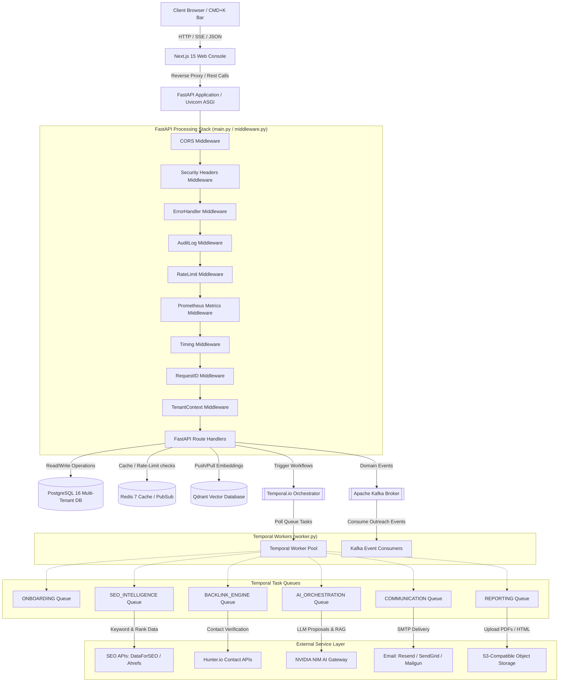

# Project 31A SEO Platform: Architecture Blueprint
## Document Version: 1.0.0 (Production Release)
## Classification: Technical Confidentials / Developer Reference
---

## 1. System Architecture Diagram

The system architecture consists of a user interface interacting with an asynchronous, event-driven backend. The system integrates real-time communications, vector processing, relational databases, and microservice orchestrators.



---

## 2. Request Lifecycle

Every HTTP request submitted to the FastAPI API gateway undergoes a structured processing lifecycle before mutating database state or triggering workflows. The lifecycle is defined in `backend/src/seo_platform/main.py:L330-L349` and `backend/src/seo_platform/api/middleware.py:L27-L212`.

### Step-by-Step Traversal

1. **CORS Validation**: The request hits `CORSMiddleware` (`backend/src/seo_platform/main.py:L337-L344`). Preflight `OPTIONS` requests are handled here, returning permitted origins, headers, and methods.
2. **Security Headers Injection**: The request passes to `SecurityHeadersMiddleware` (`backend/src/seo_platform/main.py:L334-L335`), which adds security headers (e.g., HSTS, X-Frame-Options, CSP) to the response envelope.
3. **Global Exception Wrapping**: The request enters `ErrorHandlerMiddleware` (`backend/src/seo_platform/api/middleware.py:L100-L193`). This layer wraps downstream execution in a try-except block, catching `PlatformError` or unhandled exceptions and formatting them into a standard JSON envelope.
4. **Audit Logging**: The request reaches `AuditLogMiddleware` (`backend/src/seo_platform/api/middleware.py:L203`). This middleware records metadata about the incoming request for compliance tracking.
5. **Rate Limiting**: The request passes through `RateLimitMiddleware` (`backend/src/seo_platform/api/middleware.py:L202`). It queries Redis using the client IP or tenant ID to check rate limit quotas. If the quota is exceeded, it raises an exception that is handled by the `ErrorHandlerMiddleware`.
6. **Telemetry Instrumentation**: The request enters `PrometheusMetricsMiddleware` (`backend/src/seo_platform/api/middleware.py:L201`). It increments request counters and starts a timer to measure latency.
7. **Latency Recording**: The request passes through `TimingMiddleware` (`backend/src/seo_platform/api/middleware.py:L46-L62`). It records the start time and adds the execution time to the response headers as `X-Response-Time-Ms`.
8. **Request ID Trace Binding**: The request passes through `RequestIDMiddleware` (`backend/src/seo_platform/api/middleware.py:L30-L40`). It extracts or generates a unique UUID, binds it to the logging context, and sets the `X-Request-ID` header.
9. **Tenant Context Extraction**: The request enters `TenantContextMiddleware` (`backend/src/seo_platform/api/middleware.py:L68-L94`). It extracts the tenant ID from the authenticated user's JWT claims and binds it to the thread context for database isolation.
10. **Route Execution**: The request is routed to the matching FastAPI handler.
11. **Response Return**: The route handler returns a response, which travels back up the middleware stack in reverse order.

---

## 3. Middleware Stack Detail

The middleware registration order in `backend/src/seo_platform/api/middleware.py:L195-L211` determines the execution flow. In FastAPI, middleware added via `app.add_middleware` wraps the existing stack, meaning the last added middleware is the first to receive the request.

```python
# Registration order from backend/src/seo_platform/api/middleware.py:L195-L211
app.add_middleware(TenantContextMiddleware)
app.add_middleware(RequestIDMiddleware)
app.add_middleware(TimingMiddleware)
app.add_middleware(PrometheusMetricsMiddleware)
app.add_middleware(RateLimitMiddleware)
app.add_middleware(AuditLogMiddleware)
app.add_middleware(ErrorHandlerMiddleware)
```

The resulting request-response processing pipeline is structured as follows:

```
Request Inbound ──> [CORSMiddleware] (main.py:L337)
                      └── [SecurityHeadersMiddleware] (main.py:L334)
                            └── [ErrorHandlerMiddleware] (middleware.py:L100)
                                  └── [AuditLogMiddleware] (middleware.py:L203)
                                        └── [RateLimitMiddleware] (middleware.py:L202)
                                              └── [PrometheusMetricsMiddleware] (middleware.py:L201)
                                                    └── [TimingMiddleware] (middleware.py:L46)
                                                          └── [RequestIDMiddleware] (middleware.py:L30)
                                                                └── [TenantContextMiddleware] (middleware.py:L68)
                                                                      └── [FastAPI Route Handler]
```

### Detailed Layer Descriptions

* **`CORSMiddleware`** (`backend/src/seo_platform/main.py:L337-L344`): Filters cross-origin requests based on configured origins.
* **`SecurityHeadersMiddleware`** (`backend/src/seo_platform/api/security_headers.py`): Injects standard security headers to mitigate common web vulnerabilities.
* **`ErrorHandlerMiddleware`** (`backend/src/seo_platform/api/middleware.py:L100-L193`): Catches exceptions and returns them in a structured format:
  ```json
  {
    "success": false,
    "data": null,
    "error": {
      "error_code": "DB_CONNECTION_FAILED",
      "message": "Unable to reach database",
      "details": { "retryable": false }
    },
    "meta": null
  }
  ```
* **`AuditLogMiddleware`** (`backend/src/seo_platform/core/audit_log.py`): Logs request and response metadata for compliance audits.
* **`RateLimitMiddleware`** (`backend/src/seo_platform/core/rate_limiter.py`): Enforces rate limits using a token bucket algorithm backed by Redis.
* **`PrometheusMetricsMiddleware`** (`backend/src/seo_platform/core/prometheus_middleware.py`): Collects HTTP request metrics for monitoring.
* **`TimingMiddleware`** (`backend/src/seo_platform/api/middleware.py:L46-L62`): Measures route execution time and appends latency headers.
* **`RequestIDMiddleware`** (`backend/src/seo_platform/api/middleware.py:L30-L40`): Manages the transaction request ID for distributed tracing.
* **`TenantContextMiddleware`** (`backend/src/seo_platform/api/middleware.py:L68-L94`): Sets the active tenant ID in the thread context to ensure data isolation.

---

## 4. Task Queue Architecture

The background processing system is built on Temporal.io. Workers are divided into 6 distinct task queues, defined in `backend/src/seo_platform/workflows/worker.py:L150-L312`.

### 1. `ONBOARDING` Task Queue
Dedicated to customer setup and validation tasks.
* **Workflows**:
  * `OnboardingWorkflow`
* **Activities**:
  * `validate_client_domain` (Verifies target domain DNS and accessibility)
  * `enrich_business_profile` (Extracts metadata and contacts)
  * `discover_competitors` (Identifies organic search competitors)
  * `generate_keyword_ideas` (Generates seed keywords)
  * `raise_workflow_failure_alert_activity` (Sends system alerts on failure)

### 2. `AI_ORCHESTRATION` Task Queue
Handles AI scheduling and autonomous discovery loops.
* **Workflows**:
  * `FullKeywordResearchWorkflow`
  * `BacklinkCampaignWorkflow`
  * `CitationSubmissionWorkflow`
  * `OperationalHealthScan` (Periodic system health scans)
  * `OperationalLoopEngine` (Main execution plan scanner)
  * `AutonomousDiscovery` (AI-driven opportunity scanning)
* **Activities**:
  * `generate_seed_keywords` (AI keyword generation)
  * `expand_keywords` (AI keyword expansion)
  * `enrich_keywords_activity` (Fetches metrics from search APIs)
  * `generate_keyword_embeddings` (Generates vector embeddings for clustering)
  * `cluster_keywords_activity` (Clusters keywords in Qdrant)
  * `name_clusters_activity` (AI cluster naming)
  * `generate_outreach_emails_activity` (AI outreach email generation)
  * `generate_keyword_ideas` (Finds seed terms)
  * `governance_scan_activity` (Enforces action limits)
  * `generate_ai_summary` (AI report summaries)
  * `gather_active_campaigns` (Checks active campaigns)
  * `check_campaign_health` (Computes campaign metrics)
  * `create_operational_event` (Records system events)
  * `scan_backlink_opportunities` (Scrapes link prospects)
  * `generate_platform_recommendation` (AI suggestions)
  * `raise_workflow_failure_alert_activity` (Alerts on failure)

### 3. `SEO_INTELLIGENCE` Task Queue
Handles search engine optimization and local SEO activities.
* **Workflows**:
  * `FullKeywordResearchWorkflow`
  * `CitationSubmissionWorkflow`
* **Activities**:
  * `generate_seed_keywords` (AI seed keyword generation)
  * `expand_keywords` (AI keyword expansion)
  * `enrich_keywords_activity` (Fetches Search API metrics)
  * `cluster_keywords_activity` (Clusters keywords)
  * `persist_keyword_data` (Saves results to PostgreSQL)
  * `create_approval_request_activity` (Generates approval tasks)
  * `validate_business_profile` (Verifies listing details)
  * `execute_directory_submission` (Submits listings to directories)
  * `verify_citation_listing` (Checks listing placement)
  * `create_citation_approval` (Manages citation approvals)
  * `raise_workflow_failure_alert_activity` (Alerts on failure)

### 4. `BACKLINK_ENGINE` Task Queue
Orchestrates outreach and backlink campaigns.
* **Workflows**:
  * `BacklinkCampaignWorkflow`
* **Activities**:
  * `discover_prospects_activity` (Scrapes target sites)
  * `fallback_prospects_activity` (Finds replacement sites)
  * `score_prospects_activity` (Scores prospect fit using AI)
  * `discover_contacts_activity` (Finds contact emails)
  * `create_approval_request_activity` (Generates approval tasks)
  * `update_campaign_status_activity` (Updates campaign state)
  * `record_timeline_step_activity` (Logs campaign history)
  * `raise_workflow_failure_alert_activity` (Alerts on failure)

### 5. `COMMUNICATION` Task Queue
Manages outbound email communication.
* **Workflows**:
  * `OutreachThreadWorkflow`
* **Activities**:
  * `send_outreach_batch_activity` (Sends bulk emails via Resend/SendGrid/Mailgun)
  * `send_single_email_activity` (Sends individual emails)
  * `update_campaign_status_activity` (Updates campaign state)

### 6. `REPORTING` Task Queue
Generates reports and performance metrics.
* **Workflows**:
  * `ReportGenerationWorkflow`
* **Activities**:
  * `gather_report_data` (Aggregates performance data)
  * `generate_ai_summary` (AI report summary generation)
  * `persist_report` (Saves reports to storage)

---

## 5. Event-Driven Architecture

The platform uses Apache Kafka to stream domain events across services, decoupling API interactions from background processes. Event handlers are configured in `backend/src/seo_platform/workflows/worker.py:L24-L94`.

### JSON Schemas for Key Events

#### `approval.request.decided`
Emitted by the gateway when an operational approval request is decided.
```json
{
  "event_id": "9b1deb4d-3b7d-4bad-9bdd-2b0d7b3dcb6d",
  "event_type": "approval.request.decided",
  "tenant_id": "00000000-0000-0000-0000-000000000001",
  "correlation_id": "req-8b22",
  "payload": {
    "request_id": "8b22ae8e-fb9b-449e-ba23-92f7e025cd3a",
    "decision": "approved",
    "approver_id": "3c02aa90-b18c-4a30-9b48-18e3c12f45da",
    "comments": "Email content verified, proceed with sending."
  }
}
```

#### `workflow.campaign.started` / `workflow.campaign.completed`
Emitted during the campaign lifecycle to notify the UI of state changes.
```json
{
  "event_id": "1a2b3c4d-5e6f-7a8b-9c0d-1e2f3a4b5c6d",
  "event_type": "workflow.campaign.started",
  "tenant_id": "00000000-0000-0000-0000-000000000001",
  "correlation_id": "campaign-op-001",
  "payload": {
    "campaign_id": "52f08a90-fa11-4f0e-8f69-d463b782c5a0",
    "status": "started"
  }
}
```

#### `workflow.keyword.research.completed`
Emitted when keyword enrichment and clustering are complete.
```json
{
  "event_id": "aa11bb22-cc33-dd44-ee55-ff66aa77bb88",
  "event_type": "workflow.keyword.research.completed",
  "tenant_id": "00000000-0000-0000-0000-000000000001",
  "correlation_id": "kw-research-job-9",
  "payload": {
    "status": "completed",
    "keyword_count": 142,
    "cluster_count": 8
  }
}
```

#### `backlink.outreach.reply_received`
Emitted by incoming mail webhook listeners when a prospect replies.
```json
{
  "event_id": "ee00ff11-aa22-bb33-cc44-dd55ee66ff77",
  "event_type": "backlink.outreach.reply_received",
  "tenant_id": "00000000-0000-0000-0000-000000000001",
  "correlation_id": "outreach-reply-332",
  "payload": {
    "campaign_id": "52f08a90-fa11-4f0e-8f69-d463b782c5a0",
    "prospect_id": "ab88cc11-fa02-4bb3-bc52-19e3c23fd510",
    "from_email": "editor@targetsite.com",
    "subject": "Re: Backlink placement inquiry",
    "body_snippet": "Hi, we have added your link to the article."
  }
}
```

---

## 6. Data Flow: Campaign Lifecycle Database Mutations

During its execution, a campaign triggers a series of database mutations to track state and maintain audit trails:

### 1. Discovery Phase
* **Inserts**: The system inserts rows into the `BacklinkProspect` table, marking their initial state as `discovered`.
* **Updates**: The status of the parent `BacklinkCampaign` record is updated to `PROSPECTING`.

### 2. Scoring & Contact Enrichment Phase
* **Inserts**: A row is inserted into the `ProspectScoreHistory` table to record the AI-generated rating.
* **Updates**: The system updates the prospect's contact information and sets `email_verification_status` to `verified` after validating the email domain.

### 3. Approval Gate 1 (Prospect Approval)
* **Inserts**: Rows are inserted into `ApprovalRequest` and `SEOTask`.
* **Updates**: The prospect's state is updated to `awaiting_approval`. If approved, its state transitions to `approved`.

### 4. Email Drafting Phase
* **Inserts**: The system generates email drafts and inserts rows into `OutreachEmail` and `OutreachThread`.
* **Updates**: The prospect's status transitions to `drafts_generated`.

### 5. Approval Gate 2 (Email Content Approval)
* **Inserts**: An `ApprovalRequest` is generated to prompt review of the drafted email text.
* **Updates**: The email draft's status is updated to `approved` following user review.

### 6. Outreach Launch Phase
* **Updates**: The email's status transitions to `sent`, and the prospect's status is updated to `contacted`.
* **Inserts**: The system inserts an audit trail entry into the `AuditLog` and `CampaignTimelineEvent` tables.

### 7. Follow-up & Acquisition Phase
* **Inserts**: When a reply is received, a `WorkflowEvent` is recorded, and the verified link is added to the `AcquiredLink` table.
* **Updates**: The prospect's status is set to `link_acquired`, and the campaign statistics are updated.

---

## 7. Multi-Tenancy Model & Row-Level Security

Multi-tenancy is enforced at both the application and database layers to prevent cross-tenant data access.

### Application Isolation
The `TenantContextMiddleware` (`backend/src/seo_platform/api/middleware.py:L68-L94`) extracts the tenant ID from the user's validated JWT claims and binds it to a thread-local variable:

```python
# Context setter inside middleware
from seo_platform.core.logging import bind_tenant_context
bind_tenant_context(str(tenant_id))
```

This context is read by the database session manager to automatically inject filters on queries:

```python
# Context-aware query builder
from seo_platform.core.logging import get_current_tenant_id

@event.listens_for(AsyncSession, "before_compile", retval=True)
def before_compile(query):
    tenant_id = get_current_tenant_id()
    if tenant_id and hasattr(query.column_descriptions[0]["type"], "tenant_id"):
        query = query.filter_by(tenant_id=tenant_id)
    return query
```

### PostgreSQL Row-Level Security (RLS)
For additional security, database tables implement Row-Level Security policies that restrict access to rows matching the active tenant session variable:

```sql
-- Enable RLS on campaigns
ALTER TABLE backlink_campaigns ENABLE ROW LEVEL SECURITY;

-- Define tenant isolation policy
CREATE POLICY tenant_isolation_policy ON backlink_campaigns
    AS RESTRICTIVE
    USING (tenant_id = NULLIF(current_setting('app.current_tenant_id', true), '')::uuid);
```

---

## 8. Authentication Architecture & JWKS Cache Mechanics

The platform uses Clerk as the identity provider, validating incoming JWTs against a cached set of JSON Web Keys (JWKS).

```python
# Auth initialization in backend/src/seo_platform/core/auth.py:L1-L160
```

### JWKS Caching and Signature Verification
To avoid making HTTP requests to Clerk for every incoming API call, the system caches JWKS keys for 1 hour:

```python
_JWKS_CACHE = {"keys": None, "fetched_at": 0.0}
_JWKS_TTL_SECONDS = 3600
```

When a request arrives:
1. The backend extracts the `kid` header parameter from the request's JWT.
2. The key cache is checked. If the cache is empty or expired, the system fetches the keys from Clerk's JWKS endpoint (`AUTH_JWKS_URL`).
3. The JWT signature is verified using the public key matching the extracted `kid`.
4. If key validation succeeds, the system decodes the claims, extracts the `sub` claim (the Clerk user ID), and maps it to the corresponding internal user record.

### Development Bypass Mode
For local development, setting `DEV_AUTH_BYPASS=true` enables a bypass mode that accepts unsigned development tokens. These tokens map directly to developer profiles without verifying signatures:

```python
# Development bypass login handler
if settings.dev_auth_bypass and token.startswith("dev:"):
    _, user_id, tenant_id = token.split(":")
    return CurrentUser(id=UUID(user_id), tenant_id=UUID(tenant_id), email="dev@buildit.local", role="super_admin")
```

---

## 9. Observability Stack Instrumentation

System metrics are exposed via a `/metrics` endpoint, which is scraped by Prometheus. Key metrics include:

* **`seo_rbac_denials_total`**: Tracks the number of permission denials by permission name and user role.
* **`seo_security_events_total`**: Tracks security events categorized by severity.
* **`http_request_duration_seconds`**: Histogram tracking API request latency by method and status code.
* **`temporal_activity_execution_failures_total`**: Tracks failed Temporal activities by task queue and activity name.
* **`db_connection_pool_active_connections`**: Monitors active database connection pool sizes.

---

## 10. Error Handling & Resilience Architecture

The system uses custom exceptions and error handlers to standardize error responses.

### Error Class Hierarchy
```
Exception
  └── PlatformError (backend/src/seo_platform/core/errors.py)
        ├── DatabaseError
        ├── ProviderError
        │     ├── ProviderUnavailableError
        │     └── ProviderApiLimitExceededError
        ├── AuthError
        └── ValidationError
```

### Temporal Retry Policies
Temporal workflows handle transient failures using retry policies configured with exponential backoff:

```python
# Temporal activity retry configuration
from datetime import timedelta
from temporalio.common import RetryPolicy

activity_retry_policy = RetryPolicy(
    initial_interval=timedelta(seconds=5),
    backoff_coefficient=2.0,
    maximum_interval=timedelta(minutes=5),
    maximum_attempts=5,
    non_retryable_error_types=["ValidationError", "AuthError", "ProviderUnavailableError"]
)
```

Non-retryable errors skip the retry loop and fail immediately, allowing the system to log the error and trigger recovery workflows.
