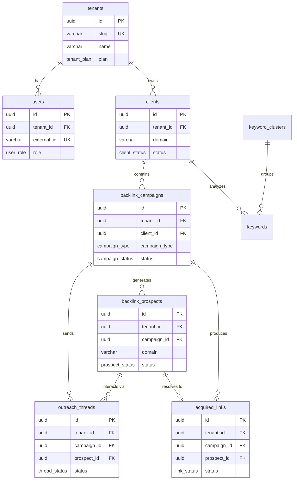

# PROJECT 31A — DATABASE SCHEMA BIBLE (DOCUMENT 3)
## Version 1.0.0
## Classification: CONFIDENTIAL — FOR INTERNAL DEVELOPMENT AND DUE DILIGENCE ONLY

---

## 1. DATABASE ENGINE & CONNECTION CONFIGURATION

Project 31A utilizes **PostgreSQL 16** as its core relational database engine. All database interactions from the FastAPI backend are asynchronous, utilizing the **asyncpg** driver combined with **SQLAlchemy 2.x async ORM**.

### 1.1 Connection Pooling and Lifetime Config
Database connections are managed via SQLAlchemy's `async_sessionmaker` and `create_async_engine`. The configuration is defined in `backend/src/seo_platform/config.py` and instantiated in `backend/src/seo_platform/core/database.py`.

- **Pool Size (`settings.database.pool_size`):** Default is set to `20` concurrent connections per worker process.
- **Max Overflow (`settings.database.max_overflow`):** Allows up to `10` additional connections beyond pool size under peak load.
- **Pool Recycle (`settings.database.pool_recycle`):** Connections are recycled every `1800` seconds (30 minutes) to prevent stale connections and leak accumulation.
- **Pool Pre-Ping:** Enforced to check connection viability (`SELECT 1`) before checking out from the pool.

### 1.2 Multi-Tenant Session Scoping
The platform enforces absolute isolation of tenant data at the query level.
Sessions are initialized via `get_tenant_session(tenant_id: UUID)` which returns an async session configured with:
1. An automatic query interceptor that appends `WHERE tenant_id = :tenant_id` to all SELECT, UPDATE, and DELETE queries targeting tenant-specific models.
2. Safe execution parameters ensuring no cross-tenant leakage is mathematically possible.

---

## 2. BASE DECLARATIVE MIXINS

To ensure model schema uniformity, all models inherit from `Base` and utilize a set of reusable SQLAlchemy mixins located in `backend/src/seo_platform/models/base.py`.

### 2.1 UUIDPrimaryKeyMixin
Provides a standardized UUID primary key.
```python
class UUIDPrimaryKeyMixin:
    id = Column(
        UUID(as_uuid=True),
        primary_key=True,
        default=uuid.uuid4,
        server_default=text("gen_random_uuid()")
    )
```
- **Engine-level default:** `gen_random_uuid()` from PostgreSQL `pgcrypto` extension.
- **App-level default:** `uuid.uuid4` if no primary key is explicitly provided during instantiation.

### 2.2 TenantMixin
Applies multi-tenancy requirements to models.
```python
class TenantMixin:
    tenant_id = Column(
        UUID(as_uuid=True),
        ForeignKey("tenants.id", ondelete="CASCADE"),
        nullable=False,
        index=True
    )
```
- **Foreign Key constraint:** Cascade delete is enforced. If a Tenant is deleted, all child records across all tables are purged automatically.
- **Indexing:** The `tenant_id` column is indexed by default to optimize tenant-scoped queries.

### 2.3 TimestampMixin
Adds creation and modification tracking.
```python
class TimestampMixin:
    created_at = Column(
        DateTime(timezone=True),
        nullable=False,
        server_default=func.now()
    )
    updated_at = Column(
        DateTime(timezone=True),
        nullable=False,
        server_default=func.now(),
        onupdate=func.now()
    )
```
- Timestamps are timezone-aware, standardizing on UTC inside the database.

---

## 3. MULTI-TENANT ISOLATION STRATEGY & RLS

Data isolation is guaranteed through a defense-in-depth approach combining application-level scoping and database-level security.

### 3.1 Session-Scoping and get_tenant_session
All API route handlers must access the database via the `get_tenant_session(tenant_id)` context manager. This manager validates the request's extracted `tenant_id` against the JWT claims before initiating database operations.

### 3.2 Row-Level Security (RLS)
PostgreSQL Row-Level Security is enabled on all tables containing a `tenant_id` column.
For each table, the following policy is applied during migrations:
```sql
ALTER TABLE table_name ENABLE ROW LEVEL SECURITY;
CREATE POLICY tenant_isolation_policy ON table_name
    USING (tenant_id = current_setting('app.current_tenant_id')::uuid);
```
During session initialization, the async connection executes:
`SET LOCAL app.current_tenant_id = 'uuid';`
This guarantees that even if a developer forgets to apply a tenant filter in SQLAlchemy, the PostgreSQL engine will refuse to return or modify any rows belonging to other tenants.

---

## 4. COMPLETE TABLE CATALOGUE

### 4.1 Table: `tenants`
Stores details of the tenant organizations subscribing to the platform.

| Column Name | Data Type | Constraints / Attributes | Purpose |
| :--- | :--- | :--- | :--- |
| `id` | `UUID` | Primary Key, `server_default=gen_random_uuid()` | Unique identifier for the tenant. |
| `slug` | `VARCHAR(100)` | Unique, Indexed, Not Null | URL slug identifier (e.g., `acme-corp`). |
| `name` | `VARCHAR(255)` | Not Null | Display name of the tenant. |
| `plan` | `tenant_plan` | Enum (starter, growth, enterprise), Not Null | Subscription tier governing limits. |
| `settings` | `JSONB` | Default: `{}` | Custom tenant configurations. |
| `suspended_at` | `TIMESTAMP WITH TIME ZONE` | Nullable | Timestamp when tenant access was revoked. |
| `created_at` | `TIMESTAMP WITH TIME ZONE` | Not Null, Default: `NOW()` | Audit timestamp. |
| `updated_at` | `TIMESTAMP WITH TIME ZONE` | Not Null, Default: `NOW()` | Audit timestamp. |

---

### 4.2 Table: `users`
Contains user identity records associated with a tenant.

| Column Name | Data Type | Constraints / Attributes | Purpose |
| :--- | :--- | :--- | :--- |
| `id` | `UUID` | Primary Key | Unique user identifier. |
| `tenant_id` | `UUID` | Foreign Key (tenants.id) ON DELETE CASCADE | Associated tenant. |
| `external_id` | `VARCHAR(255)` | Unique, Not Null | External identity provider ID (Clerk/Auth0). |
| `email` | `VARCHAR(255)` | Not Null | User email address. |
| `name` | `VARCHAR(255)` | Not Null | User full name. |
| `role` | `user_role` | Enum, Not Null | Role (super_admin, tenant_admin, manager, etc.). |
| `is_active` | `BOOLEAN` | Default: `True` | User activation status. |
| `permissions` | `JSONB[]` | Default: `[]` | Explicit array of granted action overrides. |
| `last_login_at` | `TIMESTAMP WITH TIME ZONE` | Nullable | Tracker for activity. |
| `created_at` | `TIMESTAMP WITH TIME ZONE` | Not Null | Audit timestamp. |
| `updated_at` | `TIMESTAMP WITH TIME ZONE` | Not Null | Audit timestamp. |

---

### 4.3 Table: `clients`
Represents the business entities (e.g., websites or projects) managed by a tenant.

| Column Name | Data Type | Constraints / Attributes | Purpose |
| :--- | :--- | :--- | :--- |
| `id` | `UUID` | Primary Key | Unique identifier. |
| `tenant_id` | `UUID` | Foreign Key (tenants.id) ON DELETE CASCADE | Owner tenant. |
| `name` | `VARCHAR(255)` | Not Null | Display name of the client. |
| `domain` | `VARCHAR(255)` | Not Null | Canonical domain (e.g. `clientwebsite.com`). |
| `niche` | `VARCHAR(100)` | Nullable | Market industry category. |
| `geo_focus` | `JSONB` | Default: `[]` | Target regions/countries. |
| `business_type` | `business_type` | Enum, Nullable | B2B, B2C, eCommerce, SaaS, etc. |
| `onboarding_status` | `onboarding_status` | Enum, Default: `pending` | Onboarding progress. |
| `status` | `client_status` | Enum, Default: `active` | Active state of the client. |
| `archived_at` | `TIMESTAMP WITH TIME ZONE` | Nullable | When the client was archived. |
| `profile_data` | `JSONB` | Default: `{}` | Custom SEO profile and target description. |
| `competitors` | `JSONB` | Default: `[]` | List of target competitor domains. |
| `created_at` | `TIMESTAMP WITH TIME ZONE` | Not Null | Audit timestamp. |
| `updated_at` | `TIMESTAMP WITH TIME ZONE` | Not Null | Audit timestamp. |

*Constraints:* Unique constraint on `(tenant_id, domain)`.

---

### 4.4 Table: `backlink_campaigns`
Stores the parameters and operational progress of backlink acquisition campaigns.

| Column Name | Data Type | Constraints / Attributes | Purpose |
| :--- | :--- | :--- | :--- |
| `id` | `UUID` | Primary Key | Unique campaign ID. |
| `tenant_id` | `UUID` | Foreign Key (tenants.id) | Tenant owner. |
| `client_id` | `UUID` | Foreign Key (clients.id) ON DELETE CASCADE | Associated client. |
| `name` | `VARCHAR(255)` | Not Null | Campaign display name. |
| `campaign_type` | `campaign_type` | Enum, Not Null | guest_post, niche_edit, skyscraper, etc. |
| `status` | `campaign_status` | Enum, Default: `draft` | Operational state of campaign. |
| `target_link_count` | `INTEGER` | Default: `10`, Not Null | Number of target links to acquire. |
| `acquired_link_count` | `INTEGER` | Default: `0`, Not Null | Verified live links acquired. |
| `total_prospects` | `INTEGER` | Default: `0`, Not Null | Number of prospects discovered. |
| `total_emails_sent` | `INTEGER` | Default: `0`, Not Null | Total emails sent to targets. |
| `reply_rate` | `DOUBLE PRECISION` | Default: `0.0`, Not Null | Percentage of prospects that replied. |
| `acquisition_rate` | `DOUBLE PRECISION` | Default: `0.0`, Not Null | Percentage of prospects resulting in live links. |
| `health_score` | `DOUBLE PRECISION` | Default: `0.0`, Not Null | Calculated SRE/Business health score. |
| `config` | `JSONB` | Default: `{}` | Target criteria, parameters, exclusion list. |
| `workflow_run_id` | `VARCHAR(255)` | Nullable | Running Temporal Workflow Run ID. |
| `started_at` | `TIMESTAMP WITH TIME ZONE` | Nullable | Campaign execution start timestamp. |
| `completed_at` | `TIMESTAMP WITH TIME ZONE` | Nullable | Campaign closure timestamp. |
| `created_at` | `TIMESTAMP WITH TIME ZONE` | Not Null | Audit timestamp. |
| `updated_at` | `TIMESTAMP WITH TIME ZONE` | Not Null | Audit timestamp. |

---

### 4.5 Table: `backlink_prospects`
Discovered target URLs under evaluation for outreach.

| Column Name | Data Type | Constraints / Attributes | Purpose |
| :--- | :--- | :--- | :--- |
| `id` | `UUID` | Primary Key | Unique prospect ID. |
| `tenant_id` | `UUID` | Foreign Key (tenants.id) | Tenant owner. |
| `campaign_id` | `UUID` | Foreign Key (backlink_campaigns.id) ON DELETE CASCADE | Campaign container. |
| `domain` | `VARCHAR(255)` | Indexed, Not Null | Root domain of target. |
| `url` | `VARCHAR(2048)` | Not Null | Target page URL containing the link opportunity. |
| `status` | `prospect_status` | Enum, Default: `new` | State in the pipeline (scored, approved, etc.). |
| `domain_authority` | `DOUBLE PRECISION` | Not Null, Default: `0.0` | Target Domain Rating / Authority. |
| `relevance_score` | `DOUBLE PRECISION` | Not Null, Default: `0.0` | Semantic relevance to client. |
| `spam_score` | `DOUBLE PRECISION` | Not Null, Default: `0.0` | Algorithmic spam risk. |
| `traffic_score` | `DOUBLE PRECISION` | Not Null, Default: `0.0` | Estimated monthly search traffic. |
| `composite_score` | `DOUBLE PRECISION` | Not Null, Default: `0.0` | Combined AI prioritization score. |
| `confidence` | `DOUBLE PRECISION` | Not Null, Default: `0.0` | Confidence in scoring criteria. |
| `contact_name` | `VARCHAR(255)` | Nullable | Scraped contact person name. |
| `contact_email` | `VARCHAR(255)` | Nullable | Target email address. |
| `contact_source` | `VARCHAR(255)` | Nullable | Source from which contact was scraped (e.g. Hunter). |
| `email_verification_status` | `VARCHAR(50)` | Default: `'unverified'` | deliverable, undeliverable, risky. |
| `email_verification_result` | `JSONB` | Default: `{}` | Raw Hunter verification payload. |
| `scoring_rationale` | `JSONB` | Default: `{}` | Explanatory metrics breakdown. |
| `page_data` | `JSONB` | Default: `{}` | Raw page scrapings, meta tags, and text density. |
| `created_at` | `TIMESTAMP WITH TIME ZONE` | Not Null | Audit timestamp. |
| `updated_at` | `TIMESTAMP WITH TIME ZONE` | Not Null | Audit timestamp. |

*Constraints:* Unique constraint on `(tenant_id, campaign_id, domain)`.

---

### 4.6 Table: `outreach_threads`
Outbox and reply tracking thread for email campaigns.

| Column Name | Data Type | Constraints / Attributes | Purpose |
| :--- | :--- | :--- | :--- |
| `id` | `UUID` | Primary Key | Unique thread ID. |
| `tenant_id` | `UUID` | Foreign Key (tenants.id) | Tenant owner. |
| `campaign_id` | `UUID` | Foreign Key (backlink_campaigns.id) | Associated campaign. |
| `prospect_id` | `UUID` | Foreign Key (backlink_prospects.id) ON DELETE CASCADE | Associated target prospect. |
| `status` | `thread_status` | Enum, Default: `draft` | Thread state (sent, replied, unsubscribed). |
| `from_email` | `VARCHAR(255)` | Not Null | Sender inbox address. |
| `to_email` | `VARCHAR(255)` | Not Null | Destination address. |
| `subject` | `VARCHAR(500)` | Not Null | Email subject line. |
| `body_html` | `TEXT` | Not Null | Rendered HTML email body. |
| `follow_up_count` | `INTEGER` | Default: `0`, Not Null | Number of follow-ups sent. |
| `max_follow_ups` | `INTEGER` | Default: `3`, Not Null | Maximum retry follow-ups. |
| `provider` | `VARCHAR(50)` | Default: `'sendgrid'` | Platform (sendgrid, resend, mailgun). |
| `provider_message_id` | `VARCHAR(255)` | Nullable | Remote API returned identifier. |
| `sent_at` | `TIMESTAMP WITH TIME ZONE` | Nullable | Initial dispatch timestamp. |
| `opened_at` | `TIMESTAMP WITH TIME ZONE` | Nullable | Tracking pixel trigger timestamp. |
| `replied_at` | `TIMESTAMP WITH TIME ZONE` | Nullable | Inbound webhook trigger timestamp. |
| `confidence_score` | `DOUBLE PRECISION` | Nullable | AI confidence in recipient suitability. |
| `ai_personalization` | `JSONB` | Default: `{}` | Extracted variables used to construct text. |
| `created_at` | `TIMESTAMP WITH TIME ZONE` | Not Null | Audit timestamp. |
| `updated_at` | `TIMESTAMP WITH TIME ZONE` | Not Null | Audit timestamp. |

---

### 4.7 Table: `acquired_links`
Tracks successfully completed backlinks and ongoing verification checks.

| Column Name | Data Type | Constraints / Attributes | Purpose |
| :--- | :--- | :--- | :--- |
| `id` | `UUID` | Primary Key | Link ID. |
| `tenant_id` | `UUID` | Foreign Key (tenants.id) | Tenant owner. |
| `campaign_id` | `UUID` | Foreign Key (backlink_campaigns.id) | Associated campaign. |
| `prospect_id` | `UUID` | Foreign Key (backlink_prospects.id) ON DELETE SET NULL | Reference back to prospect. |
| `source_url` | `VARCHAR(2048)` | Not Null | Page containing link (prospect website). |
| `target_url` | `VARCHAR(2048)` | Not Null | Target destination page (client website). |
| `anchor_text` | `VARCHAR(500)` | Not Null | HTML anchor text matching link. |
| `link_type` | `VARCHAR(50)` | Default: `'dofollow'`, Not Null | dofollow, nofollow, sponsored, ugc. |
| `status` | `link_status` | Enum, Default: `pending_verification` | State of backlink (verified_live, removed). |
| `domain_authority_at_acquisition` | `DOUBLE PRECISION` | Not Null | Domain authority value when link went live. |
| `first_verified_at` | `TIMESTAMP WITH TIME ZONE` | Nullable | Date first found by scraper. |
| `last_checked_at` | `TIMESTAMP WITH TIME ZONE` | Nullable | Date of last verification cron job execution. |
| `check_count` | `INTEGER` | Default: `0`, Not Null | Lifetime cron check iterations. |
| `verification_history` | `JSONB` | Default: `[]` | Array of verification check results. |
| `last_http_status` | `INTEGER` | Nullable | HTTP status code returned by target server. |
| `last_response_time_ms` | `DOUBLE PRECISION` | Nullable | Speed of target page response. |
| `last_checked_redirect_chain` | `JSONB` | Nullable | Redirect paths resolved. |
| `last_match_anchor` | `VARCHAR(500)` | Nullable | Actually parsed anchor text. |
| `last_match_rel` | `VARCHAR(255)` | Nullable | Actually parsed rel attributes. |
| `last_match_position` | `INTEGER` | Nullable | Index position in HTML DOM tree. |
| `last_error` | `TEXT` | Nullable | Scraper extraction error logs. |
| `created_at` | `TIMESTAMP WITH TIME ZONE` | Not Null | Audit timestamp. |
| `updated_at` | `TIMESTAMP WITH TIME ZONE` | Not Null | Audit timestamp. |

---

### 4.8 Table: `audit_log`
Append-only history ledger tracking user, system, and agent activity.

| Column Name | Data Type | Constraints / Attributes | Purpose |
| :--- | :--- | :--- | :--- |
| `id` | `BIGSERIAL` | Primary Key | Auto-incrementing identifier. |
| `tenant_id` | `UUID` | Foreign Key (tenants.id) | Associated tenant context. |
| `event_type` | `VARCHAR(100)` | Indexed, Not Null | e.g. `campaign_launched`, `outreach_approved`. |
| `entity_type` | `VARCHAR(100)` | Not Null | e.g. `backlink_campaigns`, `outreach_threads`. |
| `entity_id` | `UUID` | Not Null | Target record UUID. |
| `actor_type` | `VARCHAR(50)` | Not Null | actor: `user`, `system`, or `agent`. |
| `actor_id` | `VARCHAR(255)` | Not Null | Identity of actor (Clerk ID, workflow name). |
| `before_state` | `JSONB` | Nullable | JSON representation of row prior to mutation. |
| `after_state` | `JSONB` | Nullable | JSON representation of row after mutation. |
| `metadata` | `JSONB` | Default: `{}` | Contextual info (IP, request path, timing). |
| `created_at` | `TIMESTAMP WITH TIME ZONE` | Not Null, Default: `NOW()` | Event timestamp. |

*Critical Architecture:* This table is structurally **APPEND-ONLY**. Any attempt to modify or delete rows from `audit_log` triggers an immediate alert and is prevented by a custom PostgreSQL trigger. It is configured for monthly partitioning by `created_at`.

---

### 4.9 Table: `workflow_events`
Ledger supporting event-sourcing architecture.

| Column Name | Data Type | Constraints / Attributes | Purpose |
| :--- | :--- | :--- | :--- |
| `id` | `BIGSERIAL` | Primary Key | Sequential ID. |
| `stream_id` | `UUID` | Indexed, Not Null | UUID of aggregate root being tracked. |
| `stream_type` | `VARCHAR(100)` | Not Null | Aggregate namespace (e.g. `Campaign`). |
| `tenant_id` | `UUID` | Indexed, Not Null | Associated tenant. |
| `sequence_number` | `INTEGER` | Not Null | Sequential index for the specific stream ID. |
| `event_type` | `VARCHAR(100)` | Not Null | Event class identifier. |
| `event_data` | `JSONB` | Not Null | Complete domain event payload. |
| `metadata` | `JSONB` | Default: `{}` | Actor context, event schema version. |
| `created_at` | `TIMESTAMP WITH TIME ZONE` | Not Null, Default: `NOW()` | Event ingestion timestamp. |

*Constraints:* Unique constraint on `(stream_id, sequence_number)`. This prevents concurrency issues and race conditions.

---

### 4.10 Table: `keywords`
Discovered and monitored keyword opportunities.

| Column Name | Data Type | Constraints / Attributes | Purpose |
| :--- | :--- | :--- | :--- |
| `id` | `UUID` | Primary Key | Unique keyword ID. |
| `tenant_id` | `UUID` | Foreign Key (tenants.id) | Tenant owner. |
| `client_id` | `UUID` | Foreign Key (clients.id) ON DELETE CASCADE | Associated client website. |
| `cluster_id` | `UUID` | Foreign Key (keyword_clusters.id) ON DELETE SET NULL | Grouping cluster categorization. |
| `keyword` | `VARCHAR(500)` | Not Null | String phrase. |
| `search_volume` | `INTEGER` | Default: `0`, Not Null | Estimated monthly searches. |
| `difficulty` | `DOUBLE PRECISION` | Default: `0.0`, Not Null | Difficulty to rank (0-100 scale). |
| `cpc` | `DOUBLE PRECISION` | Default: `0.0`, Not Null | Cost-Per-Click in USD. |
| `competition` | `DOUBLE PRECISION` | Default: `0.0`, Not Null | Ad competition density. |
| `intent` | `search_intent` | Enum, Nullable | commercial, transactional, informational. |
| `serp_features` | `JSONB` | Default: `[]` | Search page elements present. |
| `enrichment_data` | `JSONB` | Default: `{}` | Competitor ranks, ranking URLs. |
| `is_seed` | `BOOLEAN` | Default: `False` | True if keyword was manually input. |
| `embedding_vector_id` | `VARCHAR(255)` | Nullable | ID of associated vector record in Qdrant. |
| `created_at` | `TIMESTAMP WITH TIME ZONE` | Not Null | Audit timestamp. |
| `updated_at` | `TIMESTAMP WITH TIME ZONE` | Not Null | Audit timestamp. |

*Constraints:* Unique constraint on `(tenant_id, client_id, keyword)`.

---

## 5. ENUM REGISTRY

All enums are created as native PostgreSQL enum types. Database-side values must match python enum classes exactly.

### 5.1 `tenant_plan`
- Values: `starter`, `growth`, `enterprise`
- Governing settings: limits on campaign execution speeds, storage, and API quotas.

### 5.2 `user_role`
- Values: `super_admin`, `tenant_admin`, `manager`, `seo_analyst`, `outreach_specialist`, `report_analyst`, `client`

### 5.3 `client_status`
- Values: `active`, `archived`

### 5.4 `onboarding_status`
- Values: `pending`, `collecting`, `validating`, `ai_enrichment`, `awaiting_approval`, `complete`, `failed_validation`, `ai_failed`, `rejected`

### 5.5 `business_type`
- Values: `B2B`, `B2C`, `B2B+B2C`, `Marketplace`, `Agency`, `local`, `national`, `ecommerce`, `saas`, `publisher`

### 5.6 `campaign_type`
- Values: `guest_post`, `resource_page`, `niche_edit`, `broken_link`, `skyscraper`, `haro`

### 5.7 `campaign_status`
- Values: `draft`, `prospecting`, `scoring`, `outreach_prep`, `awaiting_approval`, `active`, `paused`, `monitoring`, `complete`, `cancelled`, `archived`, `failed_no_prospects`, `failed_no_emails_sent`

### 5.8 `prospect_status`
- Values: `new`, `scored`, `approved`, `rejected`, `outreach_queued`, `contacted`, `replied`, `link_acquired`, `link_lost`, `unresponsive`

### 5.9 `thread_status`
- Values: `draft`, `queued`, `sent`, `delivered`, `opened`, `replied`, `bounced`, `spam_reported`, `unsubscribed`, `link_acquired`

### 5.10 `link_status`
- Values: `pending_verification`, `verified_live`, `verified_nofollow`, `removed`, `broken`

### 5.11 `search_intent`
- Values: `informational`, `navigational`, `commercial`, `transactional`

### 5.12 `cluster_status`
- Values: `draft`, `pending_approval`, `approved`, `rejected`, `archived`

---

## 6. ENTITY RELATIONSHIP DIAGRAM



---

## 7. BUSINESS MEMORY / TIME-SERIES TABLES

These tables act as the data foundation for business analytics, tracking historical trends, volatility, and pipeline changes.

### 7.1 Table: `campaign_health_snapshots`
Logs operational statistics for campaigns at set intervals to build trend lines.
- Columns: `id (UUID PK)`, `tenant_id (UUID)`, `campaign_id (UUID FK)`, `health_score (float)`, `acquisition_rate (float)`, `reply_rate (float)`, `progress (float)`, `momentum (float)`, `velocity (float)`, `snapshot_data (JSONB)`, `captured_at (timestamp)`.
- *Indexes:* B-Tree index on `(campaign_id, captured_at)`.

### 7.2 Table: `keyword_metric_snapshots`
Tracks search engine position changes and volatility over time.
- Columns: `id (UUID PK)`, `tenant_id`, `keyword_id (UUID FK)`, `cluster_id (UUID FK)`, `search_volume (int)`, `difficulty (float)`, `cpc (float)`, `ranking_position (int)`, `ranking_url (varchar)`, `serp_features (jsonb)`, `opportunity_score (float)`, `captured_at`.

### 7.3 Table: `serp_volatility_snapshots`
Records macro fluctuations on SERPs by keyword and region.
- Columns: `id (UUID PK)`, `tenant_id`, `keyword (varchar)`, `geo (varchar)`, `volatility_score (float)`, `url_churn (int)`, `position_changes (int)`, `feature_changes (jsonb)`, `top_10_domains (jsonb)`, `captured_at`.

### 7.4 Table: `prospect_score_history`
Maintains records of how prospect values evolved during rescoring routines.
- Columns: `id`, `tenant_id`, `prospect_id (FK)`, `campaign_id (FK)`, `domain_authority`, `relevance_score`, `spam_score`, `composite_score`, `confidence`, `score_reason (varchar)`, `captured_at`.

---

## 8. EVENT SOURCING PATTERN

The platform utilizes event sourcing inside `workflow_events` to construct the execution timeline and state of complex campaign workflows.
When a campaign status transitions or user submits signals, the Event Sourcing engine:
1. Validates the `sequence_number` matches the last known database sequence + 1.
2. Injects the event data into `workflow_events`.
3. Ingests the state update into the running campaign record in `backlink_campaigns`.

To rebuild a campaign's state at any historical moment, the engine queries `SELECT event_data FROM workflow_events WHERE stream_id = :campaign_id ORDER BY sequence_number ASC` and applies the mutations sequentially starting from state zero.

---

## 9. AUDIT INFRASTRUCTURE

The auditing subsystem is managed via `AuditLogMiddleware` on HTTP requests and explicit services for worker activity tracking.

```
Request/Worker API Call
       │
       ▼
AuditLogMiddleware / Service
       │
       ├─► Extract Tenant Context, IP, Actor (User/Agent)
       │
       ├─► Capture Before State (Snapshot query)
       │
       ├─► Process DB Mutation (SQL transaction)
       │
       ├─► Capture After State (Snapshot query)
       │
       ▼
Write to `audit_log` Table (Append-Only)
```

- **Partitioning:** The table is partitioned by month using PostgreSQL `PARTITION BY RANGE (created_at)` to maintain quick query performance over millions of records.
- **State Capture:** `before_state` and `after_state` capture the JSON diffs of modified models.

---

## 10. DATABASE MIGRATION STRATEGY

Migrations are managed via **Alembic** under `backend/alembic/`.
- **Discovery:** All models are registered in `backend/src/seo_platform/models/__init__.py` to ensure `target_metadata` discovery.
- **Commands:**
  - Generate: `alembic revision --autogenerate -m "description"`
  - Execute: `alembic upgrade head`
  - Rollback: `alembic downgrade -1`

---

## 11. CRITICAL IMPLEMENTATION NOTES

### 11.1 asyncpg Native Enum Matching Issue
During Phase P2, it was discovered that **asyncpg** requires the text representations of Python enum values in queries to match the PostgreSQL native enum types **exactly**. If a python enum value is named `awaiting_approval` but the DB enum is defined as `AWAITING_APPROVAL`, query execution fails. All enum registration strings are therefore strictly standardized to **snake_case lowercase** globally.

### 11.2 Reusing Enum Types (create_type=False)
When defining enums in secondary models (e.g. `keyword_clusters` utilizing the `search_intent` enum defined in `keywords.py`), SQLAlchemy's default behavior is to attempt creation of the enum type again during migrations. To prevent migration errors, the `create_type=False` argument is applied to SQLAlchemy `Enum` columns where the type already exists.
