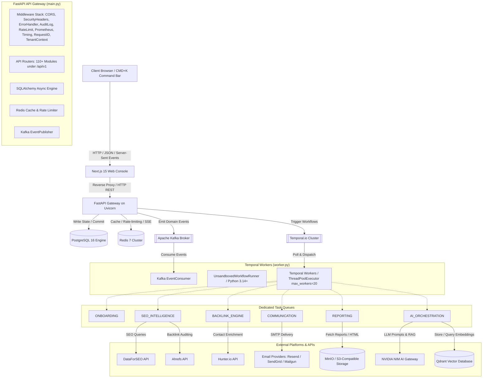

# Project 31A SEO Platform: System Technical Overview
## Document Version: 1.0.0 (Production Release)
## Classification: Technical Confidentials / Developer Reference
---

## 1. Platform Identity & Purpose

Project 31A is an enterprise-grade, high-scale, AI-powered SEO Operations and Backlink Automation Platform designed for agencies, enterprise marketing teams, and growth marketers. The platform serves as an autonomous coordination layer that optimizes organic search performance, discovers backlink opportunities, executes outreach campaigns, and submits local directory citations at scale, all while maintaining rigorous governance, compliance, and multi-tenant isolation.

### The Core Design Axiom

The system operates under a strict, non-negotiable architectural design axiom:
> **"AI proposes. Deterministic systems execute."**

This boundary ensures that while large language models (LLMs) and cognitive agents are heavily utilized for creativity, pattern recognition, and decision intelligence (e.g., scoring prospects, drafting email templates, clustering keywords, and forecasting organic search trajectories), they are entirely blocked from performing mutations on external or stateful systems. Every action proposed by an agent (such as dispatching an email batch or submitting details to a directory) is written as an execution plan to the database. These plans must pass through deterministic validation checks, policy-enforced risk scoring, and mandatory human-in-the-loop (HITL) approval gates before a hard execution is scheduled. Once approved, a highly reliable, deterministic workflow engine (Temporal.io) drives the state changes to completion, ensuring durability, linear execution histories, and auditing.

---

## 2. High-Level Architecture

The platform follows a modern, decoupled microservices-inspired architecture but is packaged as a high-performance modular monolith for deployability and ease of local orchestration. The interaction flows from the client-side browser, through the Next.js 15 routing gateway, into the FastAPI entry point, and finally gets offloaded to distributed Temporal worker pools and messaging brokers.

---

## 3. Infrastructure Components Table

The local and cloud deployment setups rely on a set of tightly integrated containerized services. The following table describes the service, Docker image, exposed port, purpose, and persistence model.

| Service Name | Docker Image / Tag | Exposed Ports | Purpose | Persistence Model |
| :--- | :--- | :--- | :--- | :--- |
| **PostgreSQL** | `postgres:16-alpine` | `5432` | Primary relational database. Stores multi-tenant schemas, users, campaigns, audit logs, and Temporal system state. | Persistent Volume Mount (`/var/lib/postgresql/data`) |
| **Redis** | `redis:7-alpine` | `6379` | High-speed cache, rate limiter, and real-time Server-Sent Events (SSE) notification broker. | Append-Only File (AOF) persistence + Volatile LRU cache (256MB) |
| **Apache Kafka** | `confluentinc/cp-kafka:7.4.0` | `9092` | Event broker. Emits and consumes domain events like outreach replies and campaign state changes. | Log directories persisted to disk; 7-day retention period. |
| **Zookeeper** | `confluentinc/cp-zookeeper:7.4.0` | `2181` | Coordinates Kafka broker metadata and election states. | File system transactional logs and snapshots. |
| **Temporal.io** | `temporalio/auto-setup:1.24.0` | `7233` | Primary orchestration server for executing durable, fault-tolerant workflows. | Backed by PostgreSQL 16 schema. |
| **Temporal UI** | `temporalio/ui:2.26.2` | `8233` | Visualization dashboard for debugging workflow status, histories, and retries. | Stateless; communicates with the Temporal Server port `7233`. |
| **Qdrant** | `qdrant/qdrant:v1.9.7` | `6333`, `6334` | Vector database for storing keyword, page, and concept embeddings used for Semantic Search and RAG. | Persistent storage block mounted to `/qdrant/storage`. |
| **MinIO** | `minio/minio:RELEASE.2024-03-03T20-27-48Z` | `9000`, `9001` | S3-compatible object storage. Stores generated PDF/HTML reports, attachments, and static assets. | File system block storage mounted to `/data`. |
| **MailHog** | `mailhog/mailhog:latest` | `1025` (SMTP), `8025` (Web UI) | Local SMTP server for capturing outbound emails during development to prevent spamming real domains. | In-memory storage (cleared upon container restart). |

---

## 4. Startup Sequence

The startup sequence of the platform is strictly defined in `backend/src/seo_platform/main.py:L62-L247` within the `lifespan` context manager. The system enforces validation gates before logging the `platform_started` event. If any check fails, uvicorn crashes immediately, preventing half-booted or unstable platform states in production.

1. **Initialize Settings and Logging** (`backend/src/seo_platform/main.py:L69-L70`):
   Loads configurations via `get_settings()` and sets up system logging using structured JSON writers via `setup_logging()`.

2. **Production Safety Validation** (`backend/src/seo_platform/main.py:L72-L94`):
   If `settings.is_production` evaluates to `True`, the gateway triggers a hard check against development bypasses. It verifies that `settings.use_mock_providers` is false, `settings.dev_auth_bypass` is false, and `settings.app_debug` is false. Finally, it invokes `validate_encryption_key_entropy()` from `seo_platform.core.encryption` to verify the master encryption key has sufficient entropy. If any of these checks fail, a `RuntimeError` is raised and startup halts.

3. **Initialize OpenTelemetry Tracer** (`backend/src/seo_platform/main.py:L95-L97`):
   Invokes `init_opentelemetry()` to mount trace providers and configure request headers propagation.

4. **Initialize Database Connection Pool** (`backend/src/seo_platform/main.py:L127-L134`):
   Calls `init_database()` to configure the async SQLAlchemy engine (`AsyncSession`), test connection capability, and establish the connection pool.

5. **Startup Schema Integrity Check** (`backend/src/seo_platform/main.py:L135-L166`):
   Calls `run_startup_integrity_check()` from `seo_platform.core.startup_integrity`. The engine performs active schema checks (e.g. comparing the current migration head in `alembic_version` with the actual migration scripts on disk, verifying tables exist, and validating columns).
   * **In Production**: Any integrity failure raises a `RuntimeError` and terminates uvicorn.
   * **In Development**: Logged as errors but does not abort, allowing developers to execute migration scripts.

6. **P0 Requirements Check** (`backend/src/seo_platform/main.py:L167-L198`):
   Calls `validate_p0_production_requirements()` from `seo_platform.core.p0_startup` to ensure all key services are configured.
   * **In Production**: Aborts if Clerk auth, external API credentials, NIM keys, or encryption settings are missing.
   * **In Development**: Emits warnings to allow the use of fallback providers.

7. **Ping Redis Server** (`backend/src/seo_platform/main.py:L199-L206`):
   Acquires a client from `get_redis()` and fires a ping to verify that port `6379` is active and responsive.

8. **Start Kafka Event Publisher** (`backend/src/seo_platform/main.py:L207-L214`):
   Resolves the global `EventPublisher` and runs `.start()` to initialize connection threads to port `9092`.

9. **Start Operational Loop Service** (`backend/src/seo_platform/main.py:L215-L221`):
   Calls `.start()` on `operational_loop` to initialize the system daemon that scans execution plans.

10. **Start Business State Evolution Daemon** (`backend/src/seo_platform/main.py:L222-L228`):
    Brings up the background analytics evaluator (`business_evolution.start()`) to build periodic campaign health snapshots.

11. **Start Alert Manager** (`backend/src/seo_platform/main.py:L229-L236`):
    Initializes the asynchronous alert dispatch mechanism (`alert_manager.start()`).

12. **Start Watchdog Orchestrator** (`backend/src/seo_platform/main.py:L237-L244`):
    Brings up `watchdog_orchestrator` to coordinate heartbeat monitors and detect stalled workers or network links.

13. **Startup Complete** (`backend/src/seo_platform/main.py:L245`):
    Emits the log statement `platform_started` and yields control back to the ASGI server context to accept inbound requests.

---

## 5. Production Safety Guards

The platform implements fail-fast mechanisms to protect production environments from misconfigurations that could expose data or bypass authentication. These guards are evaluated in `backend/src/seo_platform/main.py:L72-L94` and `backend/src/seo_platform/core/p0_startup.py:L29-L195`.

### Safe Execution Gates

* **Zero-Bypass Enforcement**: In production, the variable `settings.dev_auth_bypass` must be false. If true, the system immediately shuts down with `DEV_AUTH_BYPASS=true in production is FORBIDDEN`.
* **Zero-Mock Enforcement**: In production, `settings.use_mock_providers` must be false. If true, the server shuts down with `USE_MOCK_PROVIDERS=true in production is FORBIDDEN` to prevent simulated tasks from returning fake success states.
* **Debug Exposure Prevention**: If `settings.app_debug` is enabled, startup fails. This prevents FastAPI from showing traceback pages to users, which could leak credentials or environment configurations.
* **Encryption Entropy Validation**: The master key `ENCRYPTION_MASTER_KEY` (used for encrypting client directory credentials and API keys in transit and at rest) is validated using `validate_encryption_key_entropy()`. If the key is under 256 bits of entropy or uses simple repeats, uvicorn halts.

### Integration Validation Gates

* **Auth Verification**: The authentication provider configured must be `"clerk"`. Both `AUTH_JWKS_URL` and `AUTH_PUBLISHABLE_KEY` must be populated.
* **Email Delivery Security**: The system checks if a valid SMTP/API key is present for Resend, Mailgun, or SendGrid. In production, local MailHog fallbacks are rejected.
* **AI Engine Verification**: If `NVIDIA_NIM_API_KEY` is not present, AI proposal operations fail to load, blocking startup in production.
* **Database Schema Lock**: If `alembic_version` does not match the computed head hash, the app fails to start, forcing the operator to run `alembic upgrade head`.

---

## 6. Technology Stack

Project 31A relies on the following core technologies:

* **Backend Core**: Python 3.12+ (tested up to 3.14 compatibility).
* **API Framework**: FastAPI with Uvicorn (ASGI) for concurrent asynchronous request handling.
* **Database & ORM**: PostgreSQL 16 using SQLAlchemy 2.0 (asyncpg driver) for transaction handling and multi-tenant Row-Level Security (RLS).
* **Durable Orchestration**: Temporal.io Python SDK for writing workflows and activities.
* **Caching & Realtime Broker**: Redis 7.0 for rate limiting, JWT key caching, and pub/sub messaging for SSE.
* **Event Broker**: Apache Kafka for streaming domain events like email responses and campaign states.
* **Vector Processing**: Qdrant v1.9.7 for vector embeddings, keyword semantics, and RAG search.
* **Object Storage**: MinIO (local) and AWS S3 (production) for durable document storage.
* **Identity Management**: Clerk as the Identity Provider (IdP) with JWT signatures and cached JWKS verification.
* **Frontend Web Application**: Next.js 15 (App Router) using React 19 for the administration console, with TailwindCSS for styling and custom CSS for components.

---

## 7. Design Principles

The architecture of Project 31A is guided by several core design principles:

### Multi-Tenant Isolation
All tables in the database (with the exception of global system lookups) implement a `tenant_id` column. Multi-tenancy is enforced using the `TenantMixin` on database models (`backend/src/seo_platform/models/base.py`). Every database query is restricted to the tenant ID extracted from the authenticated user's JWT.

### Event-Driven Architecture
State transitions emit events to Kafka. For example, when a prospect replies to an email, Kafka publishes `backlink.outreach.reply_received`, which is processed by the event consumer to trigger next steps, such as link verification.

### Durable Workflows
Durable operations (like scraping, keyword research, and email outreach) are modeled as Temporal workflows. If a worker crashes or an external API fails, Temporal preserves the execution state and retries the failed step using exponential backoff.

### Fail-Loud Safety Guards
The system prioritizes failing loudly over silent failures. If an integration is misconfigured or a schema is out of sync on startup, the application terminates immediately rather than running in an unstable state.

### Idempotency
All workflow activities are designed to be idempotent. Outbound email tasks use a unique request ID, and citation submissions verify whether a profile already exists before attempting creation.

### Mock-to-Live Switching
For non-production environments, setting `USE_MOCK_PROVIDERS=true` routes external integrations through simulated local providers, allowing testing without consuming API quotas.

---

## 8. Platform Roles & RBAC Permission Matrix

The platform implements role-based access control (RBAC) to enforce security boundaries. The configuration is defined in `backend/src/seo_platform/models/tenant.py:L261-L289` via the `ROLE_PERMISSIONS` dictionary.

| User Role | Default RBAC Map | Permissions Granted |
| :--- | :--- | :--- |
| `super_admin` | `Role.SUPER_ADMIN` | `"launch_campaign"`, `"approve_outreach"`, `"view_all_clients"`, `"create_keyword_cluster"`, `"view_own_reports"`, `"export_data"`, `"manage_billing"`, `"manage_users"`, `"manage_rules"`, `"manage_kill_switches"`, `"view_audit_log"`, `"manage_tenants"` |
| `tenant_admin` | `Role.ADMIN` | `"launch_campaign"`, `"approve_outreach"`, `"view_all_clients"`, `"create_keyword_cluster"`, `"view_own_reports"`, `"export_data"`, `"manage_billing"`, `"manage_users"` |
| `manager` | `Role.MANAGER` | `"approve_outreach"`, `"view_all_clients"`, `"create_keyword_cluster"`, `"view_own_reports"`, `"export_data"` |
| `seo_analyst` | `Role.OPERATOR` | `"create_keyword_cluster"`, `"view_own_reports"` |
| `outreach_specialist`| `Role.OPERATOR` | `"create_keyword_cluster"`, `"view_own_reports"`, `"manage_outreach_threads"` |
| `report_analyst` | `Role.VIEWER` | `"view_own_reports"`, `"generate_reports"` |
| `client` | `Role.VIEWER` | `"view_own_reports"` |

Endpoint protection is enforced in the API layer using the `RequirePermission` FastAPI dependency (`backend/src/seo_platform/core/rbac.py:L195-L219`). If a user lacks the required permission, the system logs the denial, increments the `seo_rbac_denials_total` Prometheus counter, writes an entry to the immutable `AuditLedgerEntry` table, and returns a `403 Forbidden` response.

---

## 9. Key Metrics & Scale Indicators

The size and scale of Project 31A can be quantified by the following design metrics:

* **110+ Registered API Routers**: The API surface is partitioned into over 110 routers, including `/api/v1/campaigns`, `/api/v1/seo-intelligence`, `/api/v1/backlink-intelligence`, `/api/v1/ai-ops`, `/api/v1/observability`, and `/api/v1/governance`.
* **62+ Registered Database Models**: The persistence layer uses over 60 database models registered in `backend/src/seo_platform/models/__init__.py`.
* **6 Task Queues**: Workflows are distributed across 6 task queues:
  1. `ONBOARDING`
  2. `SEO_INTELLIGENCE`
  3. `BACKLINK_ENGINE`
  4. `COMMUNICATION`
  5. `REPORTING`
  6. `AI_ORCHESTRATION`
* **Concurrency Configuration**: The system is configured with a `ThreadPoolExecutor` of `max_workers=20` for executing IO-bound activities on each worker node.
* **Prometheus Metrics**: Over 50 metrics are exposed at the `/metrics` endpoint, monitoring things like API latency, database connection pools, queue depth, RBAC denials, and external API error rates.

---

## 10. Database Model Directory

Below is the exhaustive registry of SQLAlchemy database models defined in `backend/src/seo_platform/models/__init__.py`, detailing the technical metadata schemas:

### Core Identity & Access Control
1. **Tenant** (`backend/src/seo_platform/models/tenant.py`): Top-level organizational partition. Contains fields for plan (`TenantPlan` Starter/Growth/Enterprise), name, settings JSONB, and suspension timestamps.
2. **User** (`backend/src/seo_platform/models/tenant.py`): Maps external Clerk IDs (`external_id`) to internal user rows. Tracks roles, emails, active statuses, and explicit custom permission list overrides.
3. **Client** (`backend/src/seo_platform/models/tenant.py`): Represents client entities managed by tenants. Captures active/archived state, domains, and onboarding status history.
4. **AuditLog** (`backend/src/seo_platform/models/tenant.py`): Synchronous audit records storing actions, payloads, IP addresses, and user-tenant contexts.
5. **WorkflowEvent** (`backend/src/seo_platform/models/tenant.py`): System of record for event sourcing. Logs stream types, sequence numbers, event payload dicts, and correlation IDs.

### Operations & Actions Engine (Phase 14)
6. **ActionDefinition** (`backend/src/seo_platform/models/action.py`): Declares executable blocks. Stores input/output JSON schemas, timeouts, approval policy constraints, rollback handlers, and version details.
7. **ActionExecution** (`backend/src/seo_platform/models/action.py`): Tracks the execution history of actions. Stores status states, execution logs, timing performance indicators, and parent execution references.
8. **SEOTask** (`backend/src/seo_platform/models/seo_task.py`): Relational mapping for active tasks. Fields include `TaskStatus` (pending/running/completed/failed), `TaskPriority` (low/medium/high/critical), and source indicators.
9. **ApprovalPolicy** (`backend/src/seo_platform/models/approval_policy.py`): Governance configurations. Maps actions to verification steps and defines approval requirements based on risk scores.
10. **ApprovalRequest** (`backend/src/seo_platform/models/approval_policy.py`): Tracks active approvals. Stores the requested changes, requester details, approver comments, and status.
11. **ApprovalRequestModel** (`backend/src/seo_platform/models/approval.py`): Redundant/secondary approval wrapper matching original API payload conventions.
12. **AuditLedgerEntry** (`backend/src/seo_platform/models/audit_ledger.py`): Immutable audit ledger used for compliance tracking. Enforces write-once database constraints.
13. **ProviderKey** (`backend/src/seo_platform/models/provider_key.py`): Encrypted credentials for third-party integrations (e.g. DataForSEO, Ahrefs, Hunter, Resend) stored using `ENCRYPTION_MASTER_KEY`.
14. **MemoryEntry** (`backend/src/seo_platform/models/operational_memory.py`): Context entries for cognitive processes. Categorizes entries by type (semantic, episodic, working) and source.

### Backlink Outreach Engine
15. **BacklinkCampaign** (`backend/src/seo_platform/models/backlink.py`): Active campaigns targeted at gaining authority. Includes configurations for target URLs, maximum spends, and outreach cadences.
16. **BacklinkProspect** (`backend/src/seo_platform/models/backlink.py`): Target domains identified for link acquisition. Fields track Domain Rating, traffic, contact email, and verification status.
17. **OutreachThread** (`backend/src/seo_platform/models/backlink.py`): Thread context matching inbound and outbound emails. Contains subject lines, folder categories, and thread status.
18. **AcquiredLink** (`backend/src/seo_platform/models/backlink.py`): Confirmed backlinks. Tracks target URLs, referring page URLs, anchor texts, and verification timestamps.
19. **Contact** (`backend/src/seo_platform/models/contact.py`): Enriched contact details for target domains. Holds emails, job titles, and confidence scores.

### Citation Submission Engine
20. **CitationSite** (`backend/src/seo_platform/models/citation_v2.py`): Directory platforms (e.g., Yelp, YellowPages). Stores submission URLs, structural formats, categories, and authority metrics.
21. **CitationProject** (`backend/src/seo_platform/models/citation_v2.py`): Orchestrates business location data submissions. Links locations to target directories.
22. **CitationSubmissionV2** (`backend/src/seo_platform/models/citation_v2.py`): Tracks the execution state of directory submissions. Stores directory credentials, submission URLs, screenshots, and live statuses.

### Business Intelligence & Forecasting
23. **BusinessIntelligenceEvent** (`backend/src/seo_platform/models/business_memory.py`): Aggregated events for analytical reports.
24. **CampaignHealthSnapshot** (`backend/src/seo_platform/models/business_memory.py`): Weekly status snapshots capturing campaign metrics, including backlink counts, domain authority changes, and email response rates.
25. **KeywordMetricSnapshot** (`backend/src/seo_platform/models/business_memory.py`): Tracks organic performance of targeted search terms over time.
26. **ProspectScoreHistory** (`backend/src/seo_platform/models/business_memory.py`): Historical log of prospect evaluation scores. Used to refine AI scoring algorithms.
27. **RecommendationModel** (`backend/src/seo_platform/models/business_memory.py`): AI-generated recommendations to optimize campaign performance.
28. **SerpVolatilitySnapshot** (`backend/src/seo_platform/models/business_memory.py`): Tracks search engine result volatility to contextualize organic traffic changes.

### Knowledge Graph
29. **GraphEntity** (`backend/src/seo_platform/models/knowledge_graph.py`): Vertices in the semantic knowledge graph representing keywords, URLs, and business entities.
30. **GraphEdge** (`backend/src/seo_platform/models/knowledge_graph.py`): Edges representing relationships between knowledge graph entities.

### Core Utilities & Security Infrastructure
31. **DirectoryCredential** (`backend/src/seo_platform/models/credential_vault.py`): Encrypted credentials for directory submissions.
32. **CredentialAuditLog** (`backend/src/seo_platform/models/credential_vault.py`): Tracks access to the credential vault.
33. **ProxyPool** (`backend/src/seo_platform/models/rate_limiting.py`): Active proxies used to bypass rate limits during scraping.
34. **RateLimitConfig** (`backend/src/seo_platform/models/rate_limiting.py`): Global and tenant-specific rate limit configurations.
35. **EmailTemplate** (`backend/src/seo_platform/models/communication.py`): Reusable templates for outreach campaigns.
36. **OutreachEmail** (`backend/src/seo_platform/models/communication.py`): Outreach emails generated by AI, waiting for approval or scheduled for delivery.
37. **Keyword** (`backend/src/seo_platform/models/seo.py`): Targeted search terms, including volume, difficulty, and intent metrics.
38. **KeywordCluster** (`backend/src/seo_platform/models/seo.py`): Clusters of related keywords generated by vector search.
39. **KeywordResearch** (`backend/src/seo_platform/models/keywords.py`): Metadata tracking keyword research campaigns.
40. **ExecutionPlan** (`backend/src/seo_platform/models/planning.py`): Execution plans generated by AI agents.
41. **PlanNode** (`backend/src/seo_platform/models/planning.py`): Individual steps in an execution plan.
42. **NodeDependency** (`backend/src/seo_platform/models/planning.py`): Dependencies between execution plan steps.
43. **PlanForecast** (`backend/src/seo_platform/models/planning.py`): Projected performance impact of execution plans.
44. **GoalDefinition** (`backend/src/seo_platform/models/goal.py`): High-level campaign goals.
45. **GoalExecution** (`backend/src/seo_platform/models/goal.py`): Execution status of defined goals.

---

## 11. API Service Router Categories

The API surface area registered in `backend/src/seo_platform/api/router.py:L114-L387` is divided into 6 distinct categories:

### 1. Operations Control & SRE Observability
* `/api/v1/health` (`health_router`): Returns system status and checks database connectivity.
* `/api/v1/kill-switches` (`kill_switches_router`): Allows administrators to pause campaigns or API integrations in an emergency.
* `/api/v1/observability` (`observability_router`): Exposes metrics and system logs.
* `/api/v1/sre-observability` (`sre_observability_router`): Exposes detailed performance metrics for SRE monitoring.
* `/api/v1/queue-telemetry` (`realtime_telemetry_router`): Exposes Temporal task queue depths and worker latencies.
* `/api/v1/recovery` (`recovery_router`): Controls self-healing and transaction recovery workflows.
* `/api/v1/action-center` (`action_center_router`): Provides a unified view of system actions requiring attention.
* `/api/v1/temporal-ops` (`temporal_ops_router`): Allows operators to query and restart Temporal workflows.

### 2. Identity & Multi-Tenancy Management
* `/api/v1/tenants` (`tenants_router`): Admin endpoint to provision, suspend, and configure tenants.
* `/api/v1/identity` (`identity_router`): Resolves the authenticated user's context.
* `/api/v1/clients` (`clients_router`): Manages clients associated with a tenant.
* `/api/v1/customers` (`customers_router`): Provides a workspace for managing client profiles and settings.

### 3. SEO & Content Intelligence
* `/api/v1/keywords` (`keywords_router`): Manages targeted keywords and clusters.
* `/api/v1/seo-intelligence` (`seo_intelligence_router`): Fetches organic search data from DataForSEO.
* `/api/v1/serp-intelligence` (`serp_intelligence_router`): Tracks search engine result volatility.
* `/api/v1/keyword-priority` (`keyword_priority_router`): Suggests keyword priorities based on difficulty and search volume.
* `/api/v1/local-seo` (`local_seo_router`): Analyzes local listing visibility.

### 4. Backlink Outreach Engine
* `/api/v1/campaigns` (`campaigns_router`): Controls backlink acquisition campaigns.
* `/api/v1/prospects` (`prospects_router`): Manages prospects scraped for outreach campaigns.
* `/api/v1/backlink-intelligence` (`backlink_intelligence_router`): Analyzes backlink profiles using Ahrefs.
* `/api/v1/outreach-intelligence` (`outreach_intelligence_router`): Generates personalized email copy.
* `/api/v1/link-verification` (`link_verification_router`): Verifies that backlink placements are live.

### 5. Citation Submission Engine
* `/api/v1/citations` (`reports_router`): Displays directory submission reports.
* `/api/v1/citations/sites` (`citation_sites_router`): Directory submission site database.
* `/api/v1/citations/automation` (`citation_automation_router`): Monitors automated browser directory submissions.
* `/api/v1/citations/verification` (`citation_verification_router`): Monitors email verification tasks for directory submissions.

### 6. AI Agent Orchestration
* `/api/v1/goals` (`goals_router`): Sets and monitors goals for autonomous campaigns.
* `/api/v1/autonomous-agents` (`agents_router`): Controls AI agents.
* `/api/v1/ai/copilot` (`copilot_router`): Contextual chat interface for campaign planning.
* `/api/v1/ai/copilot-v2` (`copilot_v2_router`): Advanced copilot routing engine.
* `/api/v1/ai-ops` (`ai_ops_router`): Monitors cost and accuracy of LLM requests.

---

## 12. Environment Configuration Matrix

The application's runtime is controlled by configuration values set in the `.env` file. These values configure the behavior of the gateway, database, background workers, and external integrations:

### 1. General System Flags
* `APP_ENV` (`development` / `production` / `testing`): Configures the application's runtime environment. When set to `production`, safety guards are enabled and development bypasses are disabled.
* `APP_DEBUG` (`true` / `false`): Enables debug-level logging and detailed error pages. Must be `false` in production to prevent data leakage.
* `APP_SECRET_KEY` (string): Secret key used for signing session cookies and generating hashes.
* `DEV_AUTH_BYPASS` (`true` / `false`): Enables unsigned development tokens for local testing. Must be `false` in production.
* `USE_MOCK_PROVIDERS` (`true` / `false`): Routes external integrations through mock providers to prevent api quota consumption. Must be `false` in production.

### 2. Relational Database Settings
* `POSTGRES_HOST` (string): Host address of the PostgreSQL database.
* `POSTGRES_PORT` (`5432`): Network port for database connections.
* `POSTGRES_DB` (`seo_platform`): Name of the target PostgreSQL database.
* `POSTGRES_USER` (`seo_platform`): Database user role.
* `POSTGRES_PASSWORD` (string): Password for the configured database user.

### 3. Redis Cache Configurations
* `REDIS_HOST` (string): Host address of the Redis server.
* `REDIS_PORT` (`6379`): Network port for Redis connections.
* `REDIS_DB` (`0`): Database index used for caching and rate limiting.

### 4. Messaging & Coordination Brokers
* `KAFKA_BOOTSTRAP_SERVERS` (`localhost:9092`): Kafka broker host and port.
* `KAFKA_CONSUMER_GROUP_PREFIX` (`seo-platform`): Prefix used for Kafka consumer group IDs.
* `TEMPORAL_HOST` (string): Host address of the Temporal server.
* `TEMPORAL_PORT` (`7233`): Network port for Temporal connections.
* `TEMPORAL_NAMESPACE` (`seo-platform-dev`): Temporal namespace for segregating workflows.

### 5. AI Inference Gateway
* `NVIDIA_NIM_API_URL` (string): Endpoint URL for NVIDIA NIM inference.
* `NVIDIA_NIM_API_KEY` (string): API key used to authenticate with the NVIDIA NIM gateway.
* `NVIDIA_NIM_ORCHESTRATION_MODEL` (string): Model used for orchestration tasks (e.g. `meta/llama-3.3-70b-instruct`).
* `NVIDIA_NIM_SEO_MODEL` (string): Model used for SEO and keyword clustering.
* `NVIDIA_NIM_EMBEDDING_MODEL` (string): Model used to generate vector embeddings (e.g. `nvidia/nv-embedqa-e5-v5`).

### 6. Storage & Infrastructure
* `S3_ENDPOINT` (string): Endpoint URL for S3-compatible storage (e.g. local MinIO).
* `S3_ACCESS_KEY` (string): Access key for object storage authentication.
* `S3_SECRET_KEY` (string): Secret key for object storage authentication.
* `S3_BUCKET_NAME` (`seo-platform-assets`): Target bucket name for storing reports and static files.
* `ENCRYPTION_MASTER_KEY` (string): 256-bit AES master key used for encrypting sensitive credentials at rest.
